# spring-boot-vuejs

[](https://travis-ci.org/jonashackt/spring-boot-vuejs)
[](https://coveralls.io/github/jonashackt/spring-boot-vuejs?branch=master)
[](https://github.com/jonashackt/spring-boot-vuejs/blob/master/LICENSE)
[](https://renovatebot.com)
[](https://github.com/spring-projects/spring-boot)
[](https://github.com/spring-projects/spring-boot)
[](https://vuejs.org/)
[](https://nodejs.org/en/)
[](https://webpack.js.org/)
[](https://github.com/axios/axios)
[](https://jestjs.io/)
[](http://nightwatchjs.org/)
[](https://spring-boot-vuejs.herokuapp.com/)
[](https://hub.docker.com/r/jonashackt/spring-boot-vuejs)
    
> **If you´re a JavaMagazin / blog.codecentric.de / Softwerker reader**, consider switching to [vue-cli-v2-webpack-v3](https://github.com/jonashackt/spring-boot-vuejs/tree/vue-cli-v2-webpack-v3)

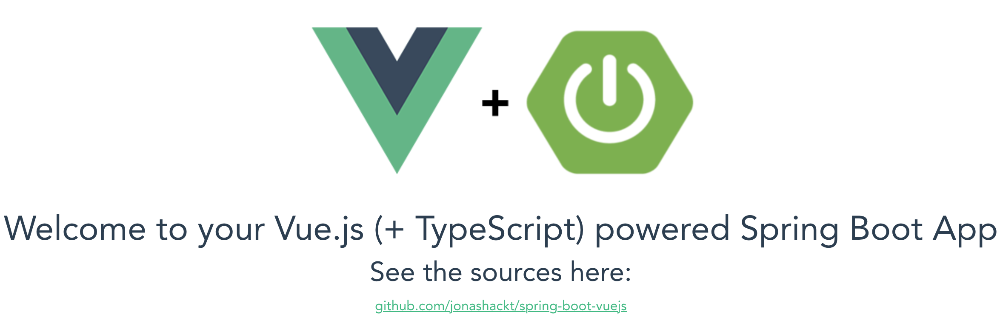

A live deployment is available on Heroku: https://spring-boot-vuejs.herokuapp.com

This project is used as example in a variety of articles & as eBook:

[](https://jaxenter.de/ausgaben/java-magazin-8-18)
[](https://www.amazon.com/Vue-js-f%C3%BCr-alle-Wissenswertes-Einsteiger-ebook/dp/B07HQF9VX4/ref=sr_1_1?ie=UTF8&qid=1538484852&sr=8-1&keywords=Vue-js-f%C3%BCr-alle-Wissenswertes-Einsteiger-ebook)
[](https://info.codecentric.de/softwerker-vol-12)

[blog.codecentric.de/en/2018/04/spring-boot-vuejs](https://blog.codecentric.de/en/2018/04/spring-boot-vuejs) | [JavaMagazin 8.2018](https://jaxenter.de/ausgaben/java-magazin-8-18) | [entwickler.press shortcuts 229](https://www.amazon.com/Vue-js-f%C3%BCr-alle-Wissenswertes-Einsteiger-ebook/dp/B07HQF9VX4/ref=sr_1_1?ie=UTF8&qid=1538484852&sr=8-1&keywords=Vue-js-f%C3%BCr-alle-Wissenswertes-Einsteiger-ebook) | [softwerker Vol.12](https://info.codecentric.de/softwerker-vol-12)

## Table of Contents  
* [In Search of a new Web Frontend-Framework after 2 Years of absence...](#in-search-of-a-new-web-frontend-framework-after-2-years-of-absence)
* [Setup Vue.js & Spring Boot](#setup-vuejs--spring-boot)
* [Project setup](#project-setup)
* [Backend](#backend)
* [Frontend](#frontend)
  * [Use frontend-maven-plugin to handle NPM, Node, Bower, Grunt, Gulp, Webpack and so on :)](#use-frontend-maven-plugin-to-handle-npm-node-bower-grunt-gulp-webpack-and-so-on-)
* [First App run](first-app-run)
* [Faster feedback with webpack-dev-server](#faster-feedback-with-webpack-dev-server)
* [Browser developer tools extension](#browser-developer-tools-extension)
* [HTTP calls from Vue.js to (Spring Boot) REST backend](#http-calls-from-vuejs-to-spring-boot-rest-backend)
  * [The problem with SOP](#the-problem-with-sop)
  * [Enabling Axios CORS support](#enabling-axios-cors-support)
  * [Enabling Spring Boot CORS support](#enabling-spring-boot-cors-support)
  * [But STOP! Webpack & Vue have something much smarter for us to help us with SOP!](#but-stop-webpack--vue-have-something-much-smarter-for-us-to-help-us-with-sop)
* [Using history mode for nicer URLs](#using-history-mode-for-nicer-urls)
* [Bootstrap & Vue.js](#bootstrap--vuejs)
* [Heroku Deployment](#heroku-deployment)
  * [Using Heroku's Postgres as Database for Spring Boot backend and Vue.js frontend](#using-herokus-postgres-as-database-for-spring-boot-backend-and-vuejs-frontend)
* [Testing](#testing)
* [Jest](#jest)
  * [Jest Configuration](#jest-configuration)
  * [Integration in Maven build (via frontend-maven-plugin)](#integration-in-maven-build-via-frontend-maven-plugin)
  * [Run Jest tests inside IntelliJ](#run-jest-tests-inside-intellij)
* [End-2-End (E2E) tests with Nightwatch](#end-2-end-e2e-tests-with-nightwatch)
  * [Write Nightwatch tests](#write-nightwatch-tests)
* [NPM Security](#npm-security)
* [Shift from templates to plugin-based architecture in Vue Cli 3](#shift-from-templates-to-plugin-based-architecture-in-vue-cli-3)
  * [OMG! My package.json is so small - Vue CLI 3 Plugins](#omg-my-packagejson-is-so-small---vue-cli-3-plugins)
  * [The vue.config.js file](#the-vueconfigjs-file)
* [Build and run with Docker](#build-and-run-with-docker)
  * [Autorelease to Docker Hub on hub.docker.com](#autorelease-to-docker-hub-on-hubdockercom)
* [Run with JDK 8, 9 or 11ff](#run-with-jdk-8-9-or-11-ff)
* [Secure Spring Boot backend and protect Vue.js frontend](#secure-spring-boot-backend-and-protect-vuejs-frontend)
  * [Secure the backend API with Spring Security](#secure-the-backend-api-with-spring-security)
  * [Configure Spring Security](#configure-spring-security)
  * [Be aware of CSRF!](#be-aware-of-csrf)
  * [Testing the secured Backend](#testing-the-secured-backend)
  * [Configure credentials inside application.properties and environment variables](#configure-credentials-inside-applicationproperties-and-environment-variables)
  * [Protect parts of Vue.js frontend](#protect-parts-of-vuejs-frontend)
  * [Create a new Vue Login component](#create-a-new-vue-login-component)
  * [Protect multiple Vue.js components](#protect-multiple-vuejs-components)
  * [Store login information with vuex](#store-login-information-with-vuex)
  * [Define the vuex state](#define-the-vuex-state)
  * [Define a vuex action login() and the mutations login_success & login_error](#define-a-vuex-action-login-and-the-mutations-login_success--login_error)
  * [Last but not least: define getters for the vuex state](#last-but-not-least-define-getters-for-the-vuex-state)
  * [Use vuex Store inside the Login component and forward to Protected.vue, if Login succeeded](#use-vuex-store-inside-the-login-component-and-forward-to-protectedvue-if-login-succeeded)
  * [Redirect user from Protected.vue to Login.vue, if not authenticated before](#redirect-user-from-protectedvue-to-loginvue-if-not-authenticated-before)
  * [Check auth state at secured backend endpoints](#check-auth-state-at-secured-backend-endpoints)


## In Search of a new Web Frontend-Framework after 2 Years of absence...

Well, I’m not a Frontend developer. I’m more like playing around with Spring Boot, Web- & Microservices & Docker, automating things with Ansible and Docker, Scaling things with Spring Cloud, Docker Compose, and Traefik... And the only GUIs I’m building are the "new JS framework in town"-app every two years... :) So the last one was Angular 1 - and it felt, as it was a good choice! I loved the coding experience and after a day of training, I felt able to write awesome Frontends...

But now we’re 2 years later and I heard from afar, that there was a complete rewrite of Angular (2), a new kid in town from Facebook (React) and lots of ES201x stuff and dependency managers like bower and Co. So I’m now in the new 2-year-cycle of trying to cope up again - and so glad I found this article: https://medium.com/reverdev/why-we-moved-from-angular-2-to-vue-js-and-why-we-didnt-choose-react-ef807d9f4163

Key points are:
* Angular 2 isn’t the way to go if you know version 1 (complete re-write, only with Typescript, loss of many of 1’s advantages, Angular 4 is coming)
* React  (facebookish problems (licence), need to choose btw. Redux & MObX, harder learning curve, slower coding speed)

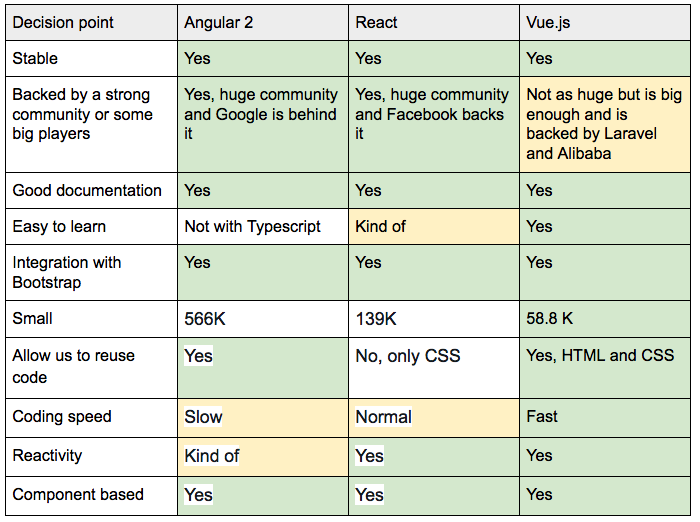

And the [introduction phrase](https://vuejs.org/v2/guide/index.html) sounds really great:

> Vue (pronounced /vjuː/, like view) is a progressive framework for building user interfaces. Unlike other monolithic frameworks, Vue is designed from the ground up to be incrementally adoptable. The core library is focused on the view layer only and is very easy to pick up and integrate with other libraries or existing projects. On the other hand, Vue is also perfectly capable of powering sophisticated Single-Page Applications when used in combination with modern tooling and supporting libraries.

So I think, it could be a good idea to invest a day or so into Vue.js. Let’s have a look here!


## Setup Vue.js & Spring Boot

### Prerequisites

#### MacOSX

```
brew install node
npm install -g @vue/cli
```

#### Linux

```
sudo apt update
sudo apt install node
npm install -g @vue/cli
```

#### Windows

```
choco install npm
npm install -g @vue/cli
```

## Project setup

```
spring-boot-vuejs
├─┬ backend     → backend module with Spring Boot code
│ ├── src
│ └── pom.xml
├─┬ frontend    → frontend module with Vue.js code
│ ├── src
│ └── pom.xml
└── pom.xml     → Maven parent pom managing both modules
```

## Backend

Go to https://start.spring.io/ and initialize a Spring Boot app with `Web` and `Actuator`. Place the zip’s contents in the backend folder.

Customize pom to copy content from Frontend for serving it later with the embedded Tomcat:

```xml
<build>
  <plugins>
    <plugin>
      <groupId>org.springframework.boot</groupId>
      <artifactId>spring-boot-maven-plugin</artifactId>
    </plugin>
    <plugin>
      <artifactId>maven-resources-plugin</artifactId>
      <executions>
        <execution>
          <id>copy Vue.js frontend content</id>
          <phase>generate-resources</phase>
          <goals>
            <goal>copy-resources</goal>
          </goals>
          <configuration>
            <outputDirectory>src/main/resources/public</outputDirectory>
            <overwrite>true</overwrite>
            <resources>
              <resource>
                <directory>${project.parent.basedir}/frontend/target/dist</directory>
                <includes>
                  <include>static/</include>
                  <include>index.html</include>
                  <include>favicon.ico</include>
                </includes>
              </resource>
            </resources>
          </configuration>
        </execution>
      </executions>
    </plugin>
  </plugins>
</build>
```


## Frontend

Creating our `frontend` project is done by the slightly changed (we use `--no-git` here, because our parent project is already a git repository and otherwise vue CLI 3 would initialize an new one):

```
vue create frontend --no-git
```

see https://cli.vuejs.org/guide/

This will initialize a project skeleton for Vue.js in /frontend directory - it, therefore, asks some questions in the cli:

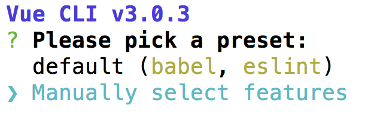

__Do not__ choose the default preset with `default (babel, eslint)`, because we need some more plugins for our project here (choose the Plugins with the __space bar__):

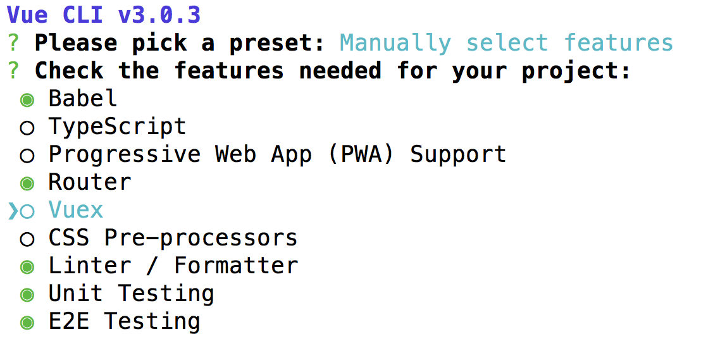

You can now also use the new `vue ui` command/feature to configure your project:

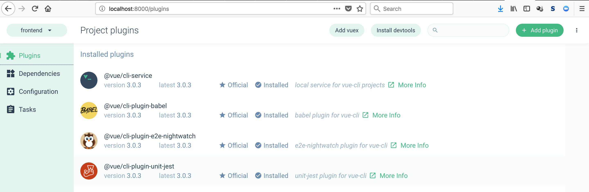

If you want to learn more about installing Vue.js, head over to the docs: https://vuejs.org/v2/guide/installation.html


### Use frontend-maven-plugin to handle NPM, Node, Bower, Grunt, Gulp, Webpack and so on :)

If you’re a backend dev like me, this Maven plugin here https://github.com/eirslett/frontend-maven-plugin is a great help for you - because, if you know Maven, that’s everything you need! Just add this plugin to the frontend’s `pom.xml`:

```xml
<build>
    <plugins>
        <plugin>
            <groupId>com.github.eirslett</groupId>
            <artifactId>frontend-maven-plugin</artifactId>
            <version>${frontend-maven-plugin.version}</version>
            <executions>
                <!-- Install our node and npm version to run npm/node scripts-->
                <execution>
                    <id>install node and npm</id>
                    <goals>
                        <goal>install-node-and-npm</goal>
                    </goals>
                    <configuration>
                        <nodeVersion>v10.10.0</nodeVersion>
                    </configuration>
                </execution>
                <!-- Install all project dependencies -->
                <execution>
                    <id>npm install</id>
                    <goals>
                        <goal>npm</goal>
                    </goals>
                    <!-- optional: default phase is "generate-resources" -->
                    <phase>generate-resources</phase>
                    <!-- Optional configuration which provides for running any npm command -->
                    <configuration>
                        <arguments>install</arguments>
                    </configuration>
                </execution>
                <!-- Build and minify static files -->
                <execution>
                    <id>npm run build</id>
                    <goals>
                        <goal>npm</goal>
                    </goals>
                    <configuration>
                        <arguments>run build</arguments>
        </configuration>
                </execution>
            </executions>
        </plugin>
    </plugins>
</build>
```

### Tell Webpack to output the dist/ contents to target/

Commonly, node projects will create a dist/ directory for builds which contains the minified source code of the web app - but we want it all in `/target`. Therefore we need to create the optional [vue.config.js](https://cli.vuejs.org/config/#vue-config-js) and configure the `outputDir` and `assetsDir` correctly: 

```javascript
module.exports = {
  ...
  // Change build paths to make them Maven compatible
  // see https://cli.vuejs.org/config/
  outputDir: 'target/dist',
  assetsDir: 'static'
}
```


## First App run

Inside the root directory, do a: 

```
mvn clean install
```

Run our complete Spring Boot App:

```
mvn --projects backend spring-boot:run
```

Now go to http://localhost:8088/ and have a look at your first Vue.js Spring Boot App.


## Faster feedback with webpack-dev-server

The webpack-dev-server, which will update and build every change through all the parts of the JavaScript build-chain, is pre-configured in Vue.js out-of-the-box! So the only thing needed to get fast feedback development-cycle is to cd into `frontend` and run:

```
npm run serve
```

That’s it! 


## Browser developer tools extension

Install vue-devtools Browser extension https://github.com/vuejs/vue-devtools and get better feedback, e.g. in Chrome:

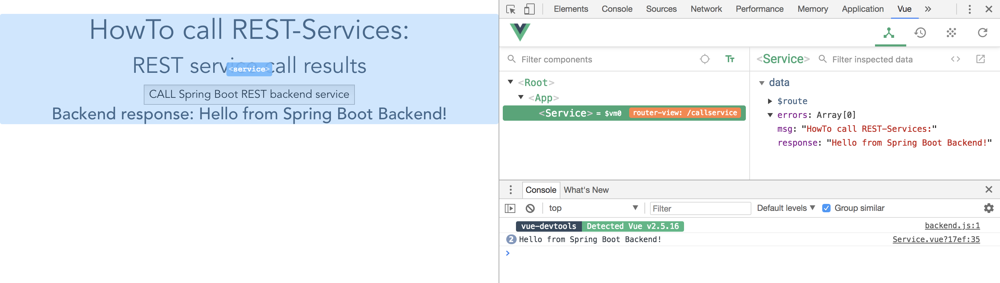


## IntelliJ integration

There's a blog post: https://blog.jetbrains.com/webstorm/2018/01/working-with-vue-js-in-webstorm/

Especially the `New... Vue Component` looks quite cool :)


## HTTP calls from Vue.js to (Spring Boot) REST backend

Prior to Vue 2.0, there was a build in solution (vue-resource). But from 2.0 on, 3rd party libraries are necessary. One of them is [Axios](https://github.com/mzabriskie/axios) - also see blog post https://alligator.io/vuejs/rest-api-axios/

```
npm install axios --save
```

Calling a REST service with Axios is simple. Go into the script area of your component, e.g. Hello.vue and add:

```js
import axios from 'axios'

data ();{
  return {
    response: [],
    errors: []
  }
},

callRestService ();{
  axios.get(`api/hello`)
    .then(response => {
      // JSON responses are automatically parsed.
      this.response = response.data
    })
    .catch(e => {
      this.errors.push(e)
    })
}
}
```

In your template area you can now request a service call via calling `callRestService()` method and access `response` data:

```html
<button class=”Search__button” @click="callRestService()">CALL Spring Boot REST backend service</button>

<h3>{{ response }}</h3>
```

### The problem with SOP

Single-Origin Policy (SOP) could be a problem if we want to develop our app. Because the webpack-dev-server runs on http://localhost:8080 and our Spring Boot REST backend on http://localhost:8088.

We need to use Cross-Origin Resource Sharing Protocol (CORS) to handle that (read more background info about CORS here https://developer.mozilla.org/en-US/docs/Web/HTTP/Access_control_CORS)


#### Enabling Axios CORS support

Create a central Axios configuration file called `http-commons.js`:

```js
import axios from 'axios'

export const AXIOS = axios.create({
  baseURL: `http://localhost:8088`,
  headers: {
    'Access-Control-Allow-Origin': 'http://localhost:8080'
  }
})
```

Here we allow requests to the base URL of our Spring Boot App on port 8088 to be accessible from 8080.

Now we could use this configuration inside our Components, e.g. in `Hello.vue`:
```js
import {AXIOS} from './http-common'

export default {
  name: 'hello',

  data () {
    return {
      posts: [],
      errors: []
    }
  },
  methods: {
    // Fetches posts when the component is created.
    callRestService () {
      AXIOS.get(`hello`)
        .then(response => {
          // JSON responses are automatically parsed.
          this.posts = response.data
        })
        .catch(e => {
          this.errors.push(e)
        })
    }
  }
```

#### Enabling Spring Boot CORS support

Additionally, we need to configure our Spring Boot backend to answer with the appropriate CORS HTTP Headers in its responses (there's a good tutorial here: https://spring.io/guides/gs/rest-service-cors/). Therefore we add the annotation `@CrossOrigin` to our BackendController:

```java
@CrossOrigin(origins = "http://localhost:8080")
@RequestMapping(path = "/hello")
public @ResponseBody String sayHello() {
    LOG.info("GET called on /hello resource");
    return HELLO_TEXT;
}
```

Now our Backend will respond CORS-enabled and will accept requests from 8080. But as this only enables CORS on one method, we have to repeatedly add this annotation to all of our REST endpoints, which isn’t a nice style. We should use a global solution to allow access with CORS enabled to all of our REST resources. This could be done in the `SpringBootVuejsApplication.class`:

```java
// Enable CORS globally
@Bean
public WebMvcConfigurer corsConfigurer() {
  return new WebMvcConfigurerAdapter() {
    @Override
    public void addCorsMappings(CorsRegistry registry) {
      registry.addMapping("/api/*").allowedOrigins("http://localhost:8080");
    }
  };
}
```

Now all calls to resources behind `api/` will return the correct CORS headers. 


#### But STOP! Webpack & Vue have something much smarter for us to help us with SOP!

Thanks to my colleague [Daniel](https://www.codecentric.de/team/dre/) who pointed me to the nice proxying feature of Webpack dev-server, we don't need to configure all the complex CORS stuff anymore!

According to the [Vue CLI 3 docs](https://cli.vuejs.org/config) the only thing we need to [configure is a devserver-proxy](https://cli.vuejs.org/config/#devserver-proxy) for our webpack devserver requests. This could be done easily in the optional [vue.config.js](https://cli.vuejs.org/config/#vue-config-js) inside `devServer.proxy`: 

```js
module.exports = {
  // proxy all webpack dev-server requests starting with /api
  // to our Spring Boot backend (localhost:8088) using http-proxy-middleware
  // see https://cli.vuejs.org/config/#devserver-proxy
  devServer: {
    proxy: {
      '/api': {
        target: 'http://localhost:8088',
        ws: true,
        changeOrigin: true
      }
    }
  },
  ...
}
```

With this configuration in place, the webpack dev-server uses the [http-proxy-middleware](https://github.com/chimurai/http-proxy-middleware), which is a really handy component, to proxy all frontend-requests from http://localhost:8080 --> http://localhost:8088 - incl. Changing the Origin accordingly.

This is used in the webpack build process to configure the proxyMiddleware (you don't need to change something here!):

```js
// proxy api requests
Object.keys(proxyTable).forEach(function (context) {
  var options = proxyTable[context];
  if (typeof options === 'string') {
    options = { target: options }
  }
  app.use(proxyMiddleware(options.filter || context, options))
})
```

## Using history mode for nicer URLs

If we use the default configuration of the generated Vue.js template, we see URLs with a `#` inside them - like this:

```
http://localhost:8098/#/bootstrap

or

http://localhost:8098/#/user
```

With the usage of __[HTML5 history mode](https://router.vuejs.org/guide/essentials/history-mode.html#html5-history-mode)__, we can achieve much nicer URLs without the `#` in them. Only thing to do in the Vue.js frontend is to configure our router accordingly inside the [router.js](frontend/src/router.js):

```
...

Vue.use(Router);

const router = new Router({
    mode: 'history', // uris without hashes #, see https://router.vuejs.org/guide/essentials/history-mode.html#html5-history-mode
    routes: [
        { path: '/', component: Hello },
        { path: '/callservice', component: Service },
        ...
```

That's nearly everything. BUT only nearly! If one clicks on a link inside our frontend, the user is correctly send to the wished component. 

But if the user enters the URL directly into the Browser, we get a `Whitelabel Error Page` because our Spring Boot backend gives us a __HTTP 404__ - since this URL isn't present in the backend:

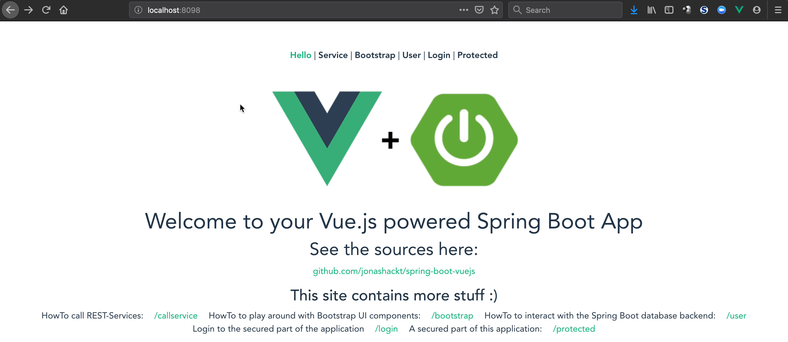

The solution is to redirect or better forward the user to the frontend (router) again. The [Vue.js docs don't provide an example configuration for Spring Boot](https://router.vuejs.org/guide/essentials/history-mode.html#example-server-configurations), but luckily [there are other resources](https://www.baeldung.com/spring-redirect-and-forward). In essence we have to implement a forwarding controller in our [BackendController](backend/src/main/java/de/jonashackt/springbootvuejs/controller/BackendController.java):

```
    // Forwards all routes to FrontEnd except: '/', '/index.html', '/api', '/api/**'
    // Required because of 'mode: history' usage in frontend routing, see README for further details
    @RequestMapping(value = "{_:^(?!index\\.html|api).$}")
    public String redirectApi() {
        LOG.info("URL entered directly into the Browser, so we need to redirect...");
        return "forward:/";
    }
```

This controller will forward every request other then `'/', '/index.html', '/api', '/api/**'` to our Vue.js frontend.


## Bootstrap & Vue.js

There’s a nice integration of Bootstrap in Vue.js: https://bootstrap-vue.js.org/

```
npm install bootstrap-vue
```

Now you can use all the pretty Bootstrap stuff with ease like:

```
<b-btn @click="callRestService()">CALL Spring Boot REST backend service</b-btn>
```

instead of

```
<button type="button" class=”btn” @click="callRestService()">CALL Spring Boot REST backend service</button>
```

The docs contain all the possible components: https://bootstrap-vue.js.org/docs/components/alert/

See some elements, when you go to http://localhost:8080/#/bootstrap/ - this should look like this:

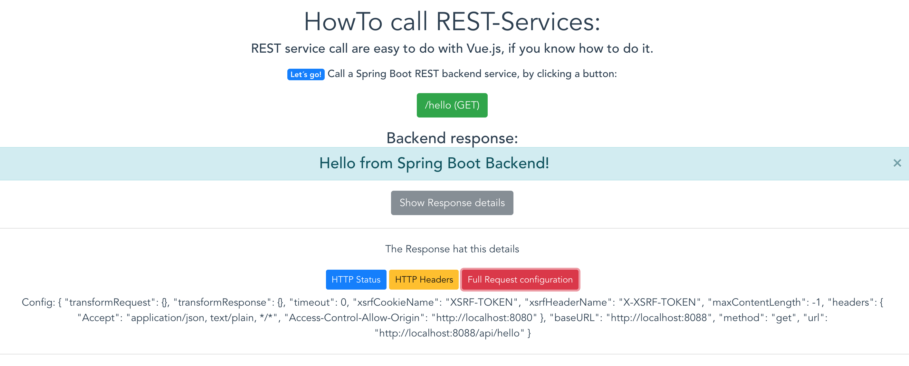

A good discussion about various UI component frameworks: http://vuetips.com/bootstrap


## Heroku Deployment

As you may already read, the app is automatically deployed to Heroku on https://spring-boot-vuejs.herokuapp.com/.

The project makes use of the nice Heroku Pipelines feature, where we do get a full Continuous Delivery pipeline with nearly no effort:


And with the help of super cool `Automatic deploys`, we have our TravisCI build our app after every push to master - and with the checkbox set to `Wait for CI to pass before deploy` - the app gets also automatically deployed to Heroku - but only, if the TravisCI (and Coveralls...) build succeeded:


You only have to connect your Heroku app to GitHub, activate Automatic deploys and set the named checkbox. That's everything!


#### Accessing Spring Boot REST backend on Heroku from Vue.js frontend

Frontend needs to know the Port of our Spring Boot backend API, which is [automatically set by Heroku every time, we (re-)start our App](https://stackoverflow.com/a/12023039/4964553).

> You can [try out your Heroku app locally](https://devcenter.heroku.com/articles/heroku-local)! Just create a .env-File with all your Environment variables and run `heroku local`! 

To access the Heroku set port, we need to use relative paths inside our Vue.js application instead of hard-coded hosts and ports! 

All we need to do is to configure Axios in such a way inside our [frontend/src/components/http-common.js](https://github.com/jonashackt/spring-boot-vuejs/blob/master/frontend/src/components/http-common.js):

```
export const AXIOS = axios.create({
  baseURL: `/api`
})
```

#### Using Heroku's Postgres as Database for Spring Boot backend and Vue.js frontend

First, add [Heroku Postgres database](https://elements.heroku.com/addons/heroku-postgresql) for your Heroku app. 

Then follow these instructions on Stackoverflow to configure all needed Environment variables in Heroku: https://stackoverflow.com/a/49978310/4964553

Mind the addition to the backend's [pom.xml](backend/pom.xml) described here: https://stackoverflow.com/a/49970142/4964553

Now you're able to use Spring Data's magic - all you need is an Interface like [UserRepository.java](backend/src/main/java/de/jonashackt/springbootvuejs/repository/UserRepository.java):

```java
package de.jonashackt.springbootvuejs.repository;

import de.jonashackt.springbootvuejs.domain.User;
import org.springframework.data.repository.CrudRepository;
import org.springframework.data.repository.query.Param;

import java.util.List;

public interface UserRepository extends CrudRepository<User, Long> {

    List<User> findByLastName(@Param("lastname") String lastname);

    List<User> findByFirstName(@Param("firstname") String firstname);

}

```

Now write your Testcases accordingly like [UserRepositoryTest.java](backend/src/test/java/de/jonashackt/springbootvuejs/repository/UserRepositoryTest.java):

```java
package de.jonashackt.springbootvuejs.repository;

import de.jonashackt.springbootvuejs.domain.User;
import org.junit.Before;
import org.junit.Test;
import org.junit.runner.RunWith;
import org.springframework.beans.factory.annotation.Autowired;
import org.springframework.boot.test.autoconfigure.orm.jpa.DataJpaTest;
import org.springframework.boot.test.autoconfigure.orm.jpa.TestEntityManager;
import org.springframework.test.context.junit4.SpringRunner;

import java.util.List;

import static org.hamcrest.Matchers.contains;
import static org.junit.Assert.*;

@RunWith(SpringRunner.class)
@DataJpaTest
public class UserRepositoryTest {

    @Autowired
    private TestEntityManager entityManager;

    @Autowired
    private UserRepository users;

    private User norbertSiegmund = new User("Norbert", "Siegmund");
    private User jonasHecht = new User("Jonas", "Hecht");

    @Before
    public void fillSomeDataIntoOurDb() {
        // Add new Users to Database
        entityManager.persist(norbertSiegmund);
        entityManager.persist(jonasHecht);
    }

    @Test
    public void testFindByLastName() throws Exception {
        // Search for specific User in Database according to lastname
        List<User> usersWithLastNameSiegmund = users.findByLastName("Siegmund");

        assertThat(usersWithLastNameSiegmund, contains(norbertSiegmund));
    }


    @Test
    public void testFindByFirstName() throws Exception {
        // Search for specific User in Database according to firstname
        List<User> usersWithFirstNameJonas = users.findByFirstName("Jonas");

        assertThat(usersWithFirstNameJonas, contains(jonasHecht));
    }

}
```

Then include this functionality in your REST-API - see [BackendController.java](backend/src/main/java/de/jonashackt/springbootvuejs/controller/BackendController.java):

```java
    @RequestMapping(path = "/user", method = RequestMethod.POST)
    @ResponseStatus(HttpStatus.CREATED)
    public @ResponseBody long addNewUser (@RequestParam String firstName, @RequestParam String lastName) {
        User user = new User(firstName, lastName);
        userRepository.save(user);

        LOG.info(user.toString() + " successfully saved into DB");

        return user.getId();
    }
```
 
and use it from the Vue.js frontend, see [User.vue](frontend/src/components/User.vue):

```html
<template>
<div class="user">
 <h1>Create User</h1>

 <h3>Just some database interaction...</h3>

 <input type="text" v-model="user.firstName" placeholder="first name">
 <input type="text" v-model="user.lastName" placeholder="last name">

 <button @click="createUser()">Create User</button>

 <div v-if="showResponse"><h6>User created with Id: {{ response }}</h6></div>

 <button v-if="showResponse" @click="retrieveUser()">Retrieve user {{user.id}} data from database</button>

 <h4 v-if="showRetrievedUser">Retrieved User {{retrievedUser.firstName}} {{retrievedUser.lastName}}</h4>

</div>
</template>

<script>
// import axios from 'axios'
import {AXIOS} from './http-common'

export default {
 name: 'user',

 data () {
   return {
     response: [],
     errors: [],
     user: {
       lastName: '',
       firstName: '',
       id: 0
     },
     showResponse: false,
     retrievedUser: {},
     showRetrievedUser: false
   }
 },
 methods: {
   // Fetches posts when the component is created.
   createUser () {
     var params = new URLSearchParams();
     params.append('firstName', this.user.firstName);
     params.append('lastName', this.user.lastName);

     AXIOS.post(`/user`, params)
       .then(response => {
         // JSON responses are automatically parsed.
         this.response = response.data;
         this.user.id = response.data;
         console.log(response.data);
         this.showResponse = true
       })
       .catch(e => {
         this.errors.push(e)
       })
   },
   retrieveUser () {
     AXIOS.get(`/user/` + this.user.id)
       .then(response => {
         // JSON responses are automatically parsed.
         this.retrievedUser = response.data;
         console.log(response.data);
         this.showRetrievedUser = true
       })
       .catch(e => {
         this.errors.push(e)
       })
   }
 }
}

</script>
```


## Testing 

### Install vue-test-utils

https://github.com/vuejs/vue-test-utils

`npm install --save-dev @vue/test-utils`

### Jest

Jest is a new shooting star in the sky of JavaScript testing frameworks: https://facebook.github.io/jest/

Intro-Blogpost: https://blog.codecentric.de/2017/06/javascript-unit-tests-sind-schwer-aufzusetzen-keep-calm-use-jest/

Examples: https://github.com/vuejs/vue-test-utils-jest-example

Vue.js Jest Docs: https://vue-test-utils.vuejs.org/guides/#testing-single-file-components-with-jest

A Jest Unittest looks like [Hello.spec.js](frontend/test/components/Hello.spec.js):

```js
import { shallowMount } from '@vue/test-utils';
import Hello from '@/components/Hello'

describe('Hello.vue', () => {
  it('should render correct hello message', () => {
    // Given
    const hellowrapped = shallowMount(Hello, {
      propsData: { hellomsg: 'Welcome to your Jest powered Vue.js App' },
      stubs: ['router-link', 'router-view']
    });

    // When
    const contentH1 = hellowrapped.find('h1');

    // Then
    expect(contentH1.text()).toEqual('Welcome to your Jest powered Vue.js App');
  })
})
```

To pass Component props while using Vue.js Router, see https://stackoverflow.com/a/37940045/4964553.

How to test components with `router-view` or `router-link` https://vue-test-utils.vuejs.org/guides/using-with-vue-router.html#testing-components-that-use-router-link-or-router-view.

The test files itself could be named `xyz.spec.js` or `xyz.test.js` - and could reside nearly everywhere in the project.

##### Jest Configuration  

The Jest run-configuration is done inside the [package.json](frontend/package.json):

```js
"scripts";: {
    ...
    "test:unit";: "vue-cli-service test:unit --coverage",;
    ....
  },
```

Jest can be configured via `jest.config.js` in your project root, or the `jest` field in [package.json](frontend/package.json). In our case we especially need to configure `coverageDirectory`:

```json
  ],
  "jest": {
    ...
    "coverageDirectory": "<rootDir>/tests/unit/coverage",
    "collectCoverageFrom": [
      "src/**/*.{js,vue}",
      "!src/main.js",
      "!src/router/index.js",
      "!**/node_modules/**"
    ]
  }
}
```

Jest needs to know the right output directory `/tests/unit/coverage` to show a correct output when `npm run test:unit` is run (or the corresponding Maven build). If you run the Jest Unit tests now with:

`npm run test:unit`

- you´ll recognize the table of test covered files:

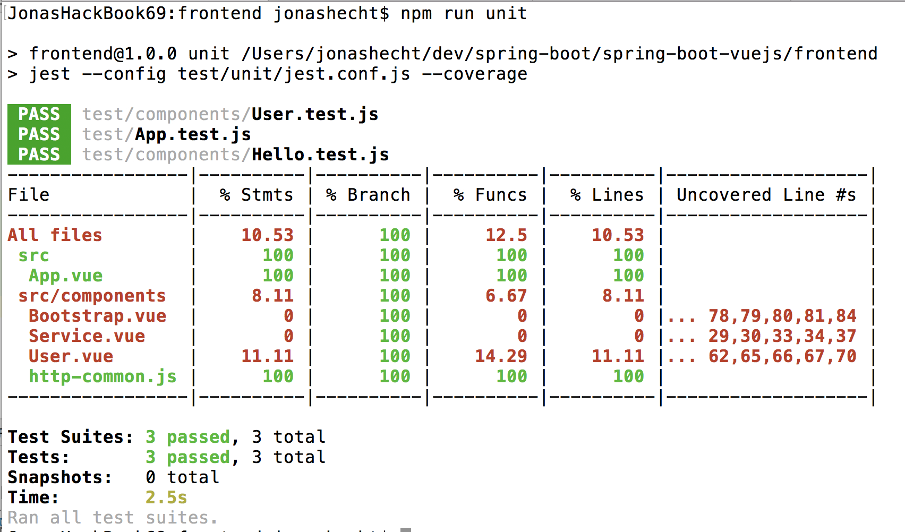


##### Integration in Maven build (via frontend-maven-plugin)

Inside the [pom.xml](pom.xml) we always automatically run the Jest Unittests with the following configuration:

```xml
<!-- Run Unit tests -->
  <execution>
    <id>npm run test:unit</id>
    <goals>
      <goal>npm</goal>
    </goals>
    <!-- optional: default phase is "generate-resources" -->
    <phase>test</phase>
    <!-- Optional configuration which provides for running any npm command -->
    <configuration>
      <arguments>run test:unit</arguments>
    </configuration>
  </execution>
```

This will integrate the Jest Unittests right after the npm run build command, just you are used to in Java-style projects:

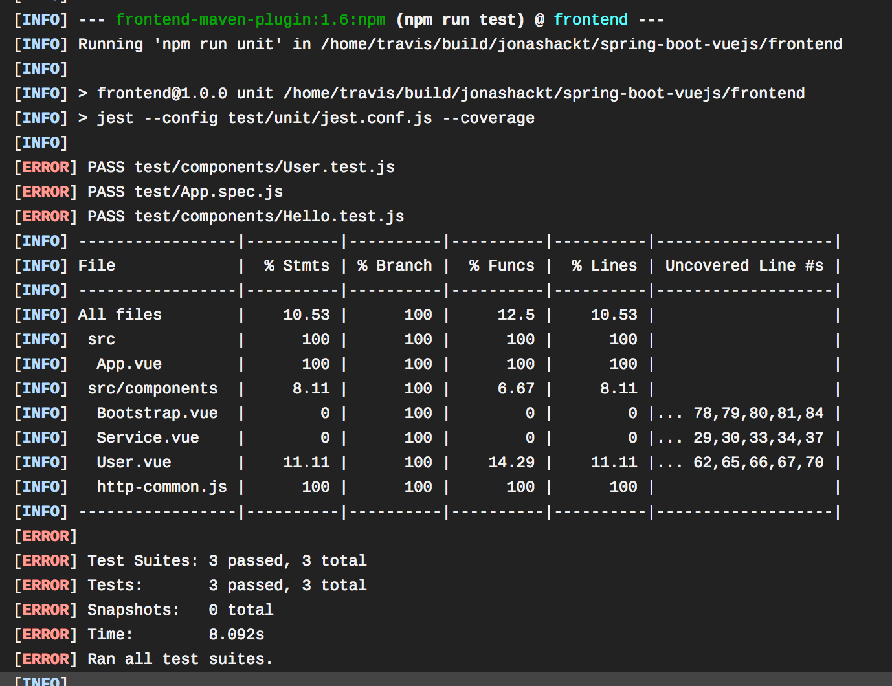

And don't mind the depiction with `ERROR` - this is just a known bug: https://github.com/eirslett/frontend-maven-plugin/issues/584


##### Run Jest tests inside IntelliJ

First, we need to install the NodeJS IntelliJ plugin (https://www.jetbrains.com/help/idea/developing-node-js-applications.html), which isn't bundled with IntelliJ by default:

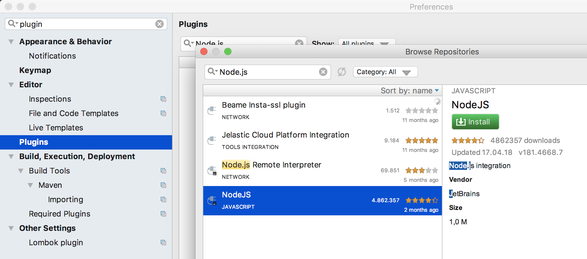

IntelliJ Jest integration docs: https://www.jetbrains.com/help/idea/running-unit-tests-on-jest.html

The automatic search inside the [package.json](frontend/package.json) for the Jest configuration file [jest.conf.js](frontend/test/unit/jest.conf.js) doesn't seem to work right now, so we have to manually configure the `scripts` part of:

```
"unit": "jest --config test/unit/jest.conf.js --coverage",
```

inside the Run Configuration under `Jest` and `All Tests`:

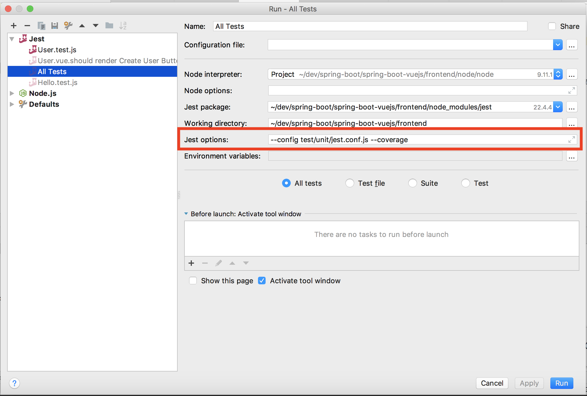

Now, when running `All Tests`, this should look like you're already used to Unittest IntelliJ-Integration:

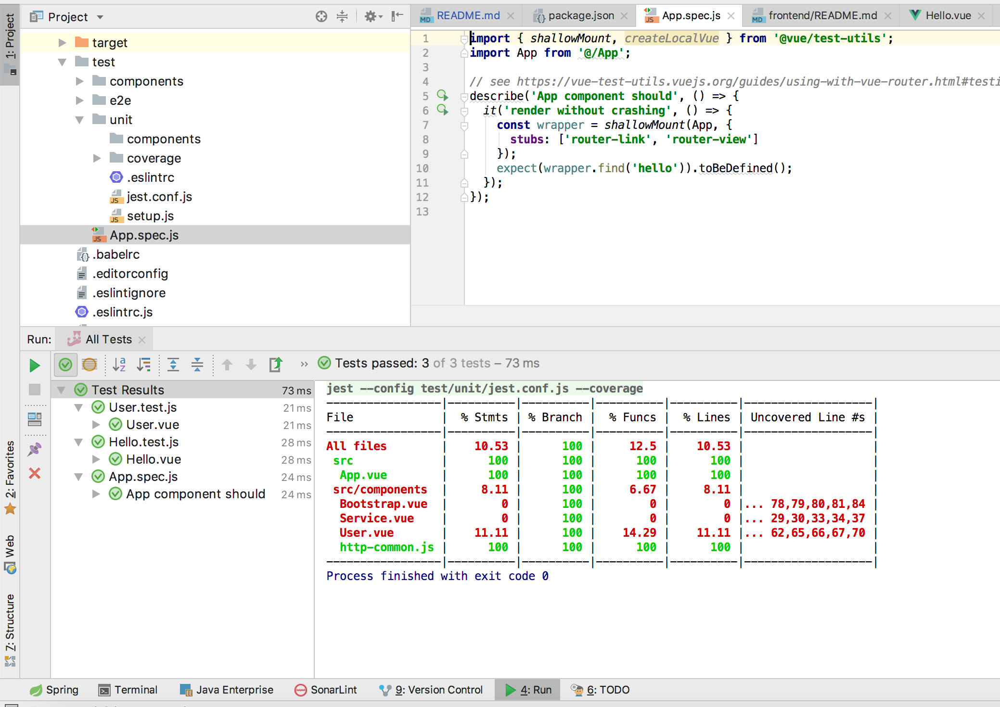

 

## End-2-End (E2E) tests with Nightwatch

Great tooling: http://nightwatchjs.org/ - Nightwatch controls WebDriver / Selenium standalone Server in own child process and abstracts from those, providing a handy DSL for Acceptance tests:

Docs: http://nightwatchjs.org/gettingstarted/#browser-drivers-setup


Nightwatch is configured through the [nightwatch.conf.js](/frontend/test/e2e/nightwatch.conf.js). Watch out for breaking changes in 1.x: https://github.com/nightwatchjs/nightwatch/wiki/Migrating-to-Nightwatch-1.0

More options could be found in the docs: http://nightwatchjs.org/gettingstarted/#settings-file


#### Write Nightwatch tests

An example Nightwatch test is provided in [HelloAcceptance.test.js](/frontend/test/e2e/specs/HelloAcceptance.test.js):

```js
module.exports = {
    'default e2e tests': browser => {
        browser
            .url(process.env.VUE_DEV_SERVER_URL)
            .waitForElementVisible('#app', 5000)
            .assert.elementPresent('.hello')
            .assert.containsText('h1', 'Welcome to your Vue.js powered Spring Boot App')
            .assert.elementCount('img', 1)
            .end()
    }
}
```

##### Run E2E Tests

`npm run test:e2e`


## Run all tests

 `npm test`


## NPM Security

npm Security - npm@6

https://medium.com/npm-inc/announcing-npm-6-5d0b1799a905

`npm audit`

https://blog.npmjs.org/post/173719309445/npm-audit-identify-and-fix-insecure

Run `npm audit fix` to update the vulnerable packages. Only in situations, where nothing else helps, try `npm audit fix --force` (this will also install braking changes)

https://nodejs.org/en/blog/vulnerability/june-2018-security-releases/

---> __Update NPM regularly__

https://docs.npmjs.com/troubleshooting/try-the-latest-stable-version-of-npm

`npm install -g npm@latest`

---> __Update Packages regularly__

https://docs.npmjs.com/getting-started/updating-local-packages

`npm outdated`

`npm update`


## Shift from templates to plugin-based architecture in Vue Cli 3

In the long run, templates like the main [webpack](https://github.com/vuejs-templates/webpack) are deprecated in the Vue.js universe:

https://vuejsdevelopers.com/2018/03/26/vue-cli-3/

Plugins bring the following benefits compared to templates:

* No lock in, as plugins can be added at any point in the development lifecycle
* Zero config plugins allow you to spend time developing rather than configuring
* Easy to upgrade, as configuration can be customized without “ejecting”
* Allows developers to make their own plugins and presets

Starting point: https://cli.vuejs.org/


#### OMG! My package.json is so small - Vue CLI 3 Plugins

From https://cli.vuejs.org/guide/plugins-and-presets.html:

> Vue CLI uses a plugin-based architecture. If you inspect a newly created project's package.json, you will find dependencies that start with `@vue/cli-plugin-`. Plugins can modify the internal webpack configuration and inject commands to `vue-cli-service`. Most of the features listed during the project creation process are implemented as plugins.

With plugings, extensions to an existing project could also be made via: `vue add pluginName`. E.g. if you want to add Nightwatch E2E tests to your project, just run `vue add @vue/e2e-nightwatch`. All scoped packages are available here: https://github.com/vuejs/vue-cli/tree/dev/packages/%40vue

These new Vue CLI 3 plugin architecture cleans our big `package.json` to a really neat compact thing. This was the old big dependency block:

````json
  "devDependencies": {
    "@vue/test-utils": "^1.0.0-beta.25",
    "autoprefixer": "^7.1.2",
    "babel-core": "^6.26.3",
    "babel-helper-vue-jsx-merge-props": "^2.0.3",
    "babel-jest": "^21.0.2",
    "babel-loader": "^7.1.5",
    "babel-plugin-dynamic-import-node": "^1.2.0",
    "babel-plugin-syntax-jsx": "^6.18.0",
    "babel-plugin-transform-es2015-modules-commonjs": "^6.26.0",
    "babel-plugin-transform-runtime": "^6.22.0",
    "babel-plugin-transform-vue-jsx": "^3.5.0",
    "babel-preset-env": "^1.7.0",
    "babel-preset-stage-2": "^6.22.0",
    "babel-register": "^6.22.0",
    "chalk": "^2.4.1",
    "chromedriver": "^2.41.0",
    "copy-webpack-plugin": "^4.5.2",
    "cross-spawn": "^5.0.1",
    "css-loader": "^0.28.0",
    "extract-text-webpack-plugin": "^3.0.0",
    "file-loader": "^1.1.4",
    "friendly-errors-webpack-plugin": "^1.6.1",
    "html-webpack-plugin": "^2.30.1",
    "jest": "^22.0.4",
    "jest-serializer-vue": "^0.3.0",
    "nightwatch": "^1.0.11",
    "node-notifier": "^5.1.2",
    "optimize-css-assets-webpack-plugin": "^3.2.0",
    "ora": "^1.2.0",
    "portfinder": "^1.0.17",
    "postcss-import": "^11.0.0",
    "postcss-loader": "^2.1.6",
    "postcss-url": "^7.2.1",
    "rimraf": "^2.6.0",
    "selenium-server": "^3.14.0",
    "semver": "^5.5.1",
    "shelljs": "^0.7.6",
    "uglifyjs-webpack-plugin": "^1.3.0",
    "url-loader": "^1.1.1",
    "vue-jest": "^1.0.2",
    "vue-loader": "^13.7.3",
    "vue-style-loader": "^3.0.1",
    "vue-template-compiler": "^2.5.17",
    "webpack": "^3.6.0",
    "webpack-bundle-analyzer": "^2.13.1",
    "webpack-dev-server": "^2.11.3",
    "webpack-merge": "^4.1.4"
  },
````

As you can see, we´re not only maintaining our high-level libraries of choice like nightwatch, jest and so on. We´re also maintaining libraries that they use itself. Now this is over with Vue CLI 3. Let´s have a look at the super clean dependency block now:

```json
"devDependencies": {
    "@vue/cli-plugin-babel": "^3.0.3",
    "@vue/cli-plugin-e2e-nightwatch": "^3.0.3",
    "@vue/cli-plugin-unit-jest": "^3.0.3",
    "@vue/cli-service": "^3.0.3",
    "@vue/test-utils": "^1.0.0-beta.20",
    "babel-core": "7.0.0-bridge.0",
    "babel-jest": "^23.0.1",
    "node-sass": "^4.9.0",
    "sass-loader": "^7.0.1",
    "vue-template-compiler": "^2.5.17"
  },
``` 

As you dig into the directories like `node_modules/@vue/cli-plugin-e2e-nightwatch`, you´ll find where the used libraries of nightwatch are configured - in the respective `package.json` there:

```json
  "dependencies": {
    "@vue/cli-shared-utils": "^3.0.2",
    "chromedriver": "^2.40.0",
    "deepmerge": "^2.1.1",
    "execa": "^0.10.0",
    "nightwatch": "^0.9.21",
    "selenium-server": "^3.13.0"
  },
```

This is really cool, I have to admit!


#### The vue.config.js file

Vue CLI 3 removes the need for explicit configuration files - and thus you wont find any `build` or `config` directories in your projects root any more. This now implements a "convention over configuration" approach, which makes it much easier to kick-start a Vue.js project, as it provides widly used defaults to webpack etc. It also eases the upgradeability of Vue.js projects - or even makes it possible. 

__But__: How do we configure webpack etc. for CORS handling, the build directories and so on? This could be done with the optional [vue.config.js](https://cli.vuejs.org/config/#vue-config-js):

```javascript
module.exports = {
  // proxy all webpack dev-server requests starting with /api
  // to our Spring Boot backend (localhost:8088) using http-proxy-middleware
  // see https://cli.vuejs.org/config/#devserver-proxy
  devServer: {
    proxy: {
      '/api': {
        target: 'http://localhost:8088',
        ws: true,
        changeOrigin: true
      }
    }
  },
  // Change build paths to make them Maven compatible
  // see https://cli.vuejs.org/config/
  outputDir: 'target/dist'
}
```

#### Updating Vue in an existing project

Update your local `@vue/cli` to the latest version:

```
npm install -g @vue/cli
```

Then update Vue.js and all your other JS dependencies with:

```
cd frontend
npm update
```


## Build and run with Docker

In the issue [jonashackt/spring-boot-vuejs/issues/25](https://github.com/jonashackt/spring-boot-vuejs/issues/25) the question on how to build and run our spring-boot-vuejs app with Docker. 

As already stated in the issue there are multiple ways of doing this. One I want to outline here is a more in-depth variant, where you'll know exacltly what's going on behind the scenes.

First we'll make use of [Docker's multi-stage build feature](https://docs.docker.com/develop/develop-images/multistage-build/) - in __the first stage__ we'll build our Spring Boot Vue.js app using our established Maven build process. Let's have a look into our [Dockerfile](Dockerfile):

```dockerfile
# Docker multi-stage build

# 1. Building the App with Maven
FROM maven:3-jdk-11

ADD . /springbootvuejs
WORKDIR /springbootvuejs

# Just echo so we can see, if everything is there :)
RUN ls -l

# Run Maven build
RUN mvn clean install
```

A crucial part here is to add all necessary files into our Docker build context - but leaving out the underlying OS specific node libraries! As not leaving them out would lead [to errors like](https://stackoverflow.com/questions/37986800/node-sass-could-not-find-a-binding-for-your-current-environment?page=1&tab=active#tab-top):

```
Node Sass could not find a binding for your current environment: Linux 64-bit with Node.js 11.x
```

Therefore we create a [.dockerignore](.dockerignore) file and leave out the directories `frontend/node_modules` & `frontend/node` completely using the `frontend/node*` configuration:

```
# exclude underlying OS specific node modules
frontend/node*

# also leave out pre-build output folders
frontend/target
backend/target
```

We also ignore the pre-build output directories.

In __the second stage__ of our [Dockerfile](Dockerfile) we use the build output of the first stage and prepare everything to run our Spring Boot powered Vue.js app later:

```dockerfile
# Just using the build artifact and then removing the build-container
FROM openjdk:11-jdk

MAINTAINER Jonas Hecht

VOLUME /tmp

# Add Spring Boot app.jar to Container
COPY --from=0 "/springbootvuejs/backend/target/backend-0.0.1-SNAPSHOT.jar" app.jar

ENV JAVA_OPTS=""

# Fire up our Spring Boot app by default
ENTRYPOINT [ "sh", "-c", "java $JAVA_OPTS -Djava.security.egd=file:/dev/./urandom -jar /app.jar" ]
```

Now we should everything prepared to run our Docker build:

```
docker build . --tag spring-boot-vuejs:latest
```

This build can take a while, since all Maven and NPM dependencies need to be downloaded for the build.

When the build is finished, simply start a Docker container based on the newly build image and prepare the correct port to be bound to the Docker host for easier access later:

```
docker run -d -p 8088:8088 --name myspringvuejs spring-boot-vuejs
```

Have a look into your running Docker containers with `docker ps` and you should see the new container:

```
$ docker ps
CONTAINER ID        IMAGE               COMMAND                  CREATED             STATUS              PORTS                    NAMES
745e854d7781        spring-boot-vuejs   "sh -c 'java $JAVA_O…"   12 seconds ago      Up 11 seconds       0.0.0.0:8088->8088/tcp   myspringvuejs
```

If you want to see the typical Spring Boot startup logs, just use `docker logs 745e854d7781 --follow`:

```
$ docker logs 745e854d7781 --follow

  .   ____          _            __ _ _
 /\\ / ___'_ __ _ _(_)_ __  __ _ \ \ \ \
( ( )\___ | '_ | '_| | '_ \/ _` | \ \ \ \
 \\/  ___)| |_)| | | | | || (_| |  ) ) ) )
  '  |____| .__|_| |_|_| |_\__, | / / / /
 =========|_|==============|___/=/_/_/_/
 :: Spring Boot ::        (v2.1.2.RELEASE)

2019-01-29 09:42:07.621  INFO 8 --- [           main] d.j.s.SpringBootVuejsApplication         : Starting SpringBootVuejsApplication v0.0.1-SNAPSHOT on 745e854d7781 with PID 8 (/app.jar started by root in /)
2019-01-29 09:42:07.627  INFO 8 --- [           main] d.j.s.SpringBootVuejsApplication         : No active profile set, falling back to default profiles: default
2019-01-29 09:42:09.001  INFO 8 --- [           main] .s.d.r.c.RepositoryConfigurationDelegate : Bootstrapping Spring Data repositories in DEFAULT mode.
2019-01-29 09:42:09.103  INFO 8 --- [           main] .s.d.r.c.RepositoryConfigurationDelegate : Finished Spring Data repository scanning in 90ms. Found 1 repository interfaces.
2019-01-29 09:42:09.899  INFO 8 --- [           main] trationDelegate$BeanPostProcessorChecker : Bean 'org.springframework.transaction.annotation.ProxyTransactionManagementConfiguration' of type [org.springframework.transaction.annotation.ProxyTransactionManagementConfiguration$$EnhancerBySpringCGLIB$$bb072d94] is not eligible for getting processed by all BeanPostProcessors (for example: not eligible for auto-proxying)
2019-01-29 09:42:10.715  INFO 8 --- [           main] o.s.b.w.embedded.tomcat.TomcatWebServer  : Tomcat initialized with port(s): 8088 (http)
2019-01-29 09:42:10.765  INFO 8 --- [           main] o.apache.catalina.core.StandardService   : Starting service [Tomcat]
2019-01-29 09:42:10.765  INFO 8 --- [           main] org.apache.catalina.core.StandardEngine  : Starting Servlet engine: [Apache Tomcat/9.0.14]
2019-01-29 09:42:10.783  INFO 8 --- [           main] o.a.catalina.core.AprLifecycleListener   : The APR based Apache Tomcat Native library which allows optimal performance in production environments was not found on the java.library.path: [/usr/java/packages/lib:/usr/lib/x86_64-linux-gnu/jni:/lib/x86_64-linux-gnu:/usr/lib/x86_64-linux-gnu:/usr/lib/jni:/lib:/usr/lib]
2019-01-29 09:42:10.920  INFO 8 --- [           main] o.a.c.c.C.[Tomcat].[localhost].[/]       : Initializing Spring embedded WebApplicationContext
2019-01-29 09:42:10.921  INFO 8 --- [           main] o.s.web.context.ContextLoader            : Root WebApplicationContext: initialization completed in 3209 ms
2019-01-29 09:42:11.822  INFO 8 --- [           main] com.zaxxer.hikari.HikariDataSource       : HikariPool-1 - Starting...
2019-01-29 09:42:12.177  INFO 8 --- [           main] com.zaxxer.hikari.HikariDataSource       : HikariPool-1 - Start completed.
2019-01-29 09:42:12.350  INFO 8 --- [           main] o.hibernate.jpa.internal.util.LogHelper  : HHH000204: Processing PersistenceUnitInfo [
	name: default
	...]
2019-01-29 09:42:12.520  INFO 8 --- [           main] org.hibernate.Version                    : HHH000412: Hibernate Core {5.3.7.Final}
2019-01-29 09:42:12.522  INFO 8 --- [           main] org.hibernate.cfg.Environment            : HHH000206: hibernate.properties not found
2019-01-29 09:42:12.984  INFO 8 --- [           main] o.hibernate.annotations.common.Version   : HCANN000001: Hibernate Commons Annotations {5.0.4.Final}
2019-01-29 09:42:13.894  INFO 8 --- [           main] org.hibernate.dialect.Dialect            : HHH000400: Using dialect: org.hibernate.dialect.H2Dialect
2019-01-29 09:42:15.644  INFO 8 --- [           main] o.h.t.schema.internal.SchemaCreatorImpl  : HHH000476: Executing import script 'org.hibernate.tool.schema.internal.exec.ScriptSourceInputNonExistentImpl@64524dd'
2019-01-29 09:42:15.649  INFO 8 --- [           main] j.LocalContainerEntityManagerFactoryBean : Initialized JPA EntityManagerFactory for persistence unit 'default'
2019-01-29 09:42:16.810  INFO 8 --- [           main] o.s.s.concurrent.ThreadPoolTaskExecutor  : Initializing ExecutorService 'applicationTaskExecutor'
2019-01-29 09:42:16.903  WARN 8 --- [           main] aWebConfiguration$JpaWebMvcConfiguration : spring.jpa.open-in-view is enabled by default. Therefore, database queries may be performed during view rendering. Explicitly configure spring.jpa.open-in-view to disable this warning
2019-01-29 09:42:17.116  INFO 8 --- [           main] o.s.b.a.w.s.WelcomePageHandlerMapping    : Adding welcome page: class path resource [public/index.html]
2019-01-29 09:42:17.604  INFO 8 --- [           main] o.s.b.a.e.web.EndpointLinksResolver      : Exposing 2 endpoint(s) beneath base path '/actuator'
2019-01-29 09:42:17.740  INFO 8 --- [           main] o.s.b.w.embedded.tomcat.TomcatWebServer  : Tomcat started on port(s): 8088 (http) with context path ''
2019-01-29 09:42:17.745  INFO 8 --- [           main] d.j.s.SpringBootVuejsApplication         : Started SpringBootVuejsApplication in 10.823 seconds (JVM running for 11.485)
```

Now access your Dockerized Spring Boot powererd Vue.js app inside your Browser at [http://localhost:8088](http://localhost:8088). 

If you have played enough with your Dockerized app, don't forget to stop (`docker stop 745e854d7781`) and remove (`docker rm 745e854d7781`) it in the end.


#### Autorelease to Docker Hub on hub.docker.com

We also want to have the current version of our code build and released to https://hub.docker.com/. Therefore head to the repositories tab in Docker Hub and click `Create Repository`:

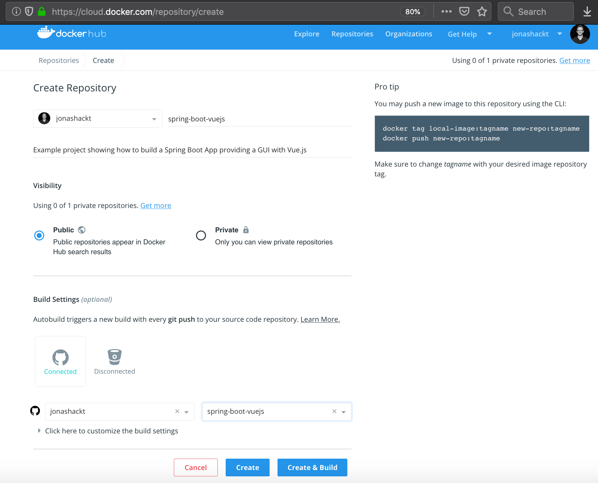

As the docs state, there are some config options to [setup automated builds](https://docs.docker.com/docker-hub/builds/).

Finally, we should see our Docker images released on https://hub.docker.com/r/jonashackt/spring-boot-vuejs and could run this app simply by executing:

```
docker run -p 8098:8098 jonashackt/spring-boot-vuejs:latest
```

This pulls the latest `jonashackt/spring-boot-vuejs` image and runs our app locally:

```
docker run -p 8098:8098 jonashackt/spring-boot-vuejs:latest
Unable to find image 'jonashackt/spring-boot-vuejs:latest' locally
latest: Pulling from jonashackt/spring-boot-vuejs
9a0b0ce99936: Pull complete
db3b6004c61a: Pull complete
f8f075920295: Pull complete
6ef14aff1139: Pull complete
962785d3b7f9: Pull complete
e275e7110d81: Pull complete
0ce121b6a2ff: Pull complete
71607a6adeb3: Pull complete
Digest: sha256:4037576ba5f6c58ed067eeef3ab2870a9de8dd1966a5906cb3d36d0ad98fa541
Status: Downloaded newer image for jonashackt/spring-boot-vuejs:latest

  .   ____          _            __ _ _
 /\\ / ___'_ __ _ _(_)_ __  __ _ \ \ \ \
( ( )\___ | '_ | '_| | '_ \/ _` | \ \ \ \
 \\/  ___)| |_)| | | | | || (_| |  ) ) ) )
  '  |____| .__|_| |_|_| |_\__, | / / / /
 =========|_|==============|___/=/_/_/_/
 :: Spring Boot ::        (v2.2.0.RELEASE)

2019-11-02 16:15:37.967  INFO 7 --- [           main] d.j.s.SpringBootVuejsApplication         : Starting SpringBootVuejsApplication v0.0.1-SNAPSHOT on aa490bc6ddf4 with PID 7 (/app.jar started by root in /)
2019-11-02 16:15:37.973  INFO 7 --- [           main] d.j.s.SpringBootVuejsApplication         : No active profile set, falling back to default profiles: default
2019-11-02 16:15:39.166  INFO 7 --- [           main] .s.d.r.c.RepositoryConfigurationDelegate : Bootstrapping Spring Data repositories in DEFAULT mode.
2019-11-02 16:15:39.285  INFO 7 --- [           main] .s.d.r.c.RepositoryConfigurationDelegate : Finished Spring Data repository scanning in 99ms. Found 1 repository interfaces.
2019-11-02 16:15:39.932  INFO 7 --- [           main] trationDelegate$BeanPostProcessorChecker : Bean 'org.springframework.transaction.annotation.ProxyTransactionManagementConfiguration' of type [org.springframework.transaction.annotation.ProxyTransactionManagementConfiguration] is not eligible for getting processed by all BeanPostProcessors (for example: not eligible for auto-proxying)
2019-11-02 16:15:40.400  INFO 7 --- [           main] o.s.b.w.embedded.tomcat.TomcatWebServer  : Tomcat initialized with port(s): 8098 (http)
2019-11-02 16:15:40.418  INFO 7 --- [           main] o.apache.catalina.core.StandardService   : Starting service [Tomcat]
...
2019-11-02 16:15:54.048  INFO 7 --- [nio-8098-exec-1] o.s.web.servlet.DispatcherServlet        : Initializing Servlet 'dispatcherServlet'
2019-11-02 16:15:54.081  INFO 7 --- [nio-8098-exec-1] o.s.web.servlet.DispatcherServlet        : Completed initialization in 32 ms
```


Now head over to [http://localhost:8098/](http://localhost:8098/) and see the app live :)


# Run with JDK 8, 9 or 11 ff

As with Spring Boot, we can define the desired Java version simply by editing our backend's [pom.xml](backend/pom.xml): 

```
	<properties>
		<java.version>1.8</java.version>
	</properties>
```

If you want to have `JDK9`, place a `<java.version>9</java.version>` or other versions just as you like to (see [this stackoverflow answer](https://stackoverflow.com/questions/54467287/how-to-specify-java-11-version-in-spring-spring-boot-pom-xml)).

Spring Boot handles the needed `maven.compiler.release`, which tell's Java from version 9 on to build for a specific target.

We just set `1.8` as the baseline here, since if we set a newer version as the standard, builds on older versions then 8 will fail (see [this build log for example](https://travis-ci.org/jonashackt/spring-boot-vuejs/builds/547227298).

Additionally, we use TravisCI to run the Maven build on some mayor Java versions - have a look into the [.travis.yml](.travis.yml):

```
language: java
jdk:
  - oraclejdk8
  - oraclejdk9
  - oraclejdk11
```


# Secure Spring Boot backend and protect Vue.js frontend

Securing parts of our application must consist of two parts: securing the Spring Boot backend - and reacting on that secured backend in the Vue.js frontend.

https://spring.io/guides/tutorials/spring-security-and-angular-js/

https://developer.okta.com/blog/2018/11/20/build-crud-spring-and-vue

https://auth0.com/blog/vuejs2-authentication-tutorial/

https://medium.com/@zitko/structuring-a-vue-project-authentication-87032e5bfe16


## Secure the backend API with Spring Security

https://spring.io/guides/tutorials/spring-boot-oauth2

https://spring.io/guides/gs/securing-web/

https://www.baeldung.com/rest-assured-authentication

Now let's focus on securing our Spring Boot backend first! Therefore we introduce a new RESTful resource, that we want to secure specifically:


                   +---+                  +---+                  +---+
                   |   | /api/hello       |   | /api/user        |   | /api/secured
                   +---+                  +---+                  +---+
                     |                      |                      |
        +-----------------------------------------------------------------------+
        |                                                                       |
        |                                                                       |
        |                                                                       |
        |                                                                       |
        |                                                                       |
        |  Spring Boot backend                                                  |
        |                                                                       |
        +-----------------------------------------------------------------------+


#### Configure Spring Security

First we add a new REST resource `/secured` inside our `BackendController we want to secure - and use in a separate frontend later:

```
    @GetMapping(path="/secured")
    public @ResponseBody String getSecured() {
        LOG.info("GET successfully called on /secured resource");
        return SECURED_TEXT;
    }
```

With Spring it is relatively easy to secure our API. Let's add `spring-boot-starter-security` to our [pom.xml](backend/pom.xml):

```xml
		<!-- Secure backend API -->
		<dependency>
			<groupId>org.springframework.boot</groupId>
			<artifactId>spring-boot-starter-security</artifactId>
		</dependency>

		<dependency>
			<groupId>org.springframework.security</groupId>
			<artifactId>spring-security-test</artifactId>
			<scope>test</scope>
		</dependency>
```

Also create a new @Configuration annotated class called [WebSecurityConfiguration.class](backend/src/main/java/de/jonashackt/springbootvuejs/configuration/WebSecurityConfiguration.java):

```java
package de.jonashackt.springbootvuejs.configuration;

import org.springframework.context.annotation.Configuration;
import org.springframework.security.config.annotation.authentication.builders.AuthenticationManagerBuilder;
import org.springframework.security.config.annotation.web.builders.HttpSecurity;
import org.springframework.security.config.annotation.web.configuration.EnableWebSecurity;
import org.springframework.security.config.annotation.web.configuration.WebSecurityConfigurerAdapter;
import org.springframework.security.config.http.SessionCreationPolicy;

@Configuration
@EnableWebSecurity
public class WebSecurityConfiguration extends WebSecurityConfigurerAdapter {

    @Override
    protected void configure(HttpSecurity http) throws Exception {

        http
            .sessionManagement().sessionCreationPolicy(SessionCreationPolicy.STATELESS) // No session will be created or used by spring security
        .and()
            .httpBasic()
        .and()
            .authorizeRequests()
                .antMatchers("/api/hello").permitAll()
                .antMatchers("/api/user/**").permitAll() // allow every URI, that begins with '/api/user/'
                .antMatchers("/api/secured").authenticated()
                .anyRequest().authenticated() // protect all other requests
        .and()
            .csrf().disable(); // disable cross site request forgery, as we don't use cookies - otherwise ALL PUT, POST, DELETE will get HTTP 403!
    }

    @Override
    protected void configure(AuthenticationManagerBuilder auth) throws Exception {
        auth.inMemoryAuthentication()
                .withUser("foo").password("{noop}bar").roles("USER");
    }
}

```

Using a simple `http.httpBasic()` we configure to provide a Basic Authentication for our secured resources.

To deep dive into the Matcher configurations, have a look into https://docs.spring.io/spring-security/site/docs/current/reference/htmlsingle/#jc-authorize-requests

#### Be aware of CSRF!

__BUT:__ Be aware of the CSRF (cross site request forgery) part! The defaults will render a [HTTP 403 FORBIDDEN for any HTTP verb that modifies state (PATCH, POST, PUT, DELETE)](https://docs.spring.io/spring-security/site/docs/current/reference/htmlsingle/#csrf-configure):

> by default Spring Security’s CSRF protection will produce an HTTP 403 access denied.

For now we can disable the default behavior with `http.csrf().disable()`


#### Testing the secured Backend

See https://www.baeldung.com/rest-assured-authentication

Inside our [BackendControllerTest](backend/src/test/java/de/jonashackt/springbootvuejs/controller/BackendControllerTest.java) we should check, whether our API reacts with correct HTTP 401 UNAUTHORIZED, when called without our User credentials:

```
	@Test
	public void secured_api_should_react_with_unauthorized_per_default() {

		given()
		.when()
			.get("/api/secured")
		.then()
			.statusCode(HttpStatus.SC_UNAUTHORIZED);
	}
```

Using `rest-assured` we can also test, if one could access the API correctly with the credentials included:

```
	@Test
	public void secured_api_should_give_http_200_when_authorized() {

		given()
			.auth().basic("foo", "bar")
		.when()
			.get("/api/secured")
		.then()
			.statusCode(HttpStatus.SC_OK)
			.assertThat()
				.body(is(equalTo(BackendController.SECURED_TEXT)));
	}
```

The crucial point here is to use the `given().auth().basic("foo", "bar")` configuration to inject the correct credentials properly.


#### Configure credentials inside application.properties and environment variables

Defining the users (and passwords) inside code (like our [WebSecurityConfiguration.class](backend/src/main/java/de/jonashackt/springbootvuejs/configuration/WebSecurityConfiguration.java)) that should be given access to our application is a test-only practice!

For our super simple example application, we could have a solution quite similar - but much more safe: If we would be able to extract this code into configuration and later use Spring's powerful mechanism of overriding these configuration with environment variables, we could then store them safely inside our deployment pipelines settings, that are again secured by another login - e.g. as Heroku Config Vars.

Therefore the first step would be to delete the following code:

```
@Override
    protected void configure(AuthenticationManagerBuilder auth) throws Exception {
        auth.inMemoryAuthentication()
                .withUser("foo").password("{noop}bar").roles("USER");
    }
```

and add the following configuration to our [application.properties](backend/src/main/resources/application.properties):

```
spring.security.user.name=sina
spring.security.user.password=miller
```

Running our tests using the old credentials should fail now. Providing the newer one, the test should go green again.

Now introducing environment variables to the game could also be done locally inside our IDE for example. First change the test `secured_api_should_give_http_200_when_authorized` again and choose some new credentials like user `maik` with pw `meyer`.

Don't change the `application.properties` right now - use your IDE's run configuration and insert two environment variables:

```
SPRING_SECURITY_USER_NAME=maik
SPRING_SECURITY_USER_PASSWORD=meyer
```

Now the test should run green again with this new values.


## Protect parts of Vue.js frontend

Now that we have secured a specific part of our backend API, let's also secure a part of our Vue.js frontend:

        +-----------------------------------------------------------------------+
        |  Vue.js frontend                                                      |
        |                                                                       |
        |   +-----------------+    +-----------------+    +-----------------+   |
        |   |                 |    |                 |    |                 |   |
        |   |                 |    |                 |    |  Protected      |   |
        |   |                 |    |                 |    |                 |   |
        |   |                 |    |                 |    |  Vue.js View    |   |
        |   |                 |    |                 |    |                 |   |
        |   +-----------------+    +-----------------+    +-----------------+   |
        |                                                                       |
        +-----------------------------------------------------------------------+

                   +---+                  +---+                  +---+
                   |   | /api/hello       |   | /api/user        |   | /api/secured
                   +---+                  +---+                  +---+
                     |                      |                      |
        +-----------------------------------------------------------------------+
        |                                                                       |
        |                                                                       |
        |                                                                       |
        |                                                                       |
        |                                                                       |
        |                                                                       |
        |  Spring Boot backend                                                  |
        +-----------------------------------------------------------------------+


#### Create a new Vue Login component

As there is already a secured Backend API, we also want to have a secured frontend part. 

Every solution you find on the net seems to be quite overengineered for the "super-small-we-have-to-ship-today-app". Why should we bother with a frontend auth store like vuex at the beginning? Why start with OAuth right up front? These could be easily added later on!

The simplest solution one could think about how to secure our frontend, would be to create a simple Login.vue component, that simply accesses the `/api/secured` resource every time the login is used.

Therefore we use [Vue.js conditionals](https://vuejs.org/v2/guide/conditional.html) to show something on our new [Login.vue](frontend/src/components/Login.vue):

```
<template>
  <div class="protected" v-if="loginSuccess">
    <h1><b-badge variant="success">Access to protected site granted!</b-badge></h1>
    <h5>If you're able to read this, you've successfully logged in.</h5>
  </div>
  <div class="unprotected" v-else-if="loginError">
    <h1><b-badge variant="danger">You don't have rights here, mate :D</b-badge></h1>
    <h5>Seams that you don't have access rights... </h5>
  </div>
  <div class="unprotected" v-else>
    <h1><b-badge variant="info">Please login to get access!</b-badge></h1>
    <h5>You're not logged in - so you don't see much here. Try to log in:</h5>

    <form @submit.prevent="callLogin()">
      <input type="text" placeholder="username" v-model="user">
      <input type="password" placeholder="password" v-model="password">
      <b-btn variant="success" type="submit">Login</b-btn>
      <p v-if="error" class="error">Bad login information</p>
    </form>
  </div>

</template>

<script>
import api from './backend-api'

export default {
  name: 'login',

  data () {
    return {
      loginSuccess: false,
      loginError: false,
      user: '',
      password: '',
      error: false
    }
  }
}

</script>
``` 

For now the conditional is only handled by two boolean values: `loginSuccess` and `loginError`.

To bring those to life, we implement the `callLogin()` method:

```
,
  methods: {
    callLogin() {
      api.getSecured(this.user, this.password).then(response => {
        console.log("Response: '" + response.data + "' with Statuscode " + response.status)
        if(response.status == 200) {
          this.loginSuccess = true
        }
      }).catch(error => {
        console.log("Error: " + error)
        this.loginError = true
      })
    }
  }
```

With this simple implementation, the Login component asks the Spring Boot backend, if a user is allowed to access the `/api/secured` resource. The [backend-api.js](frontend/src/components/backend-api.js) provides an method, which uses axios' Basic Auth feature:

```
    getSecured(user, password) {
        return AXIOS.get(`/secured/`,{
            auth: {
                username: user,
                password: password
            }});
    }
``` 

Now the Login component works for the first time:

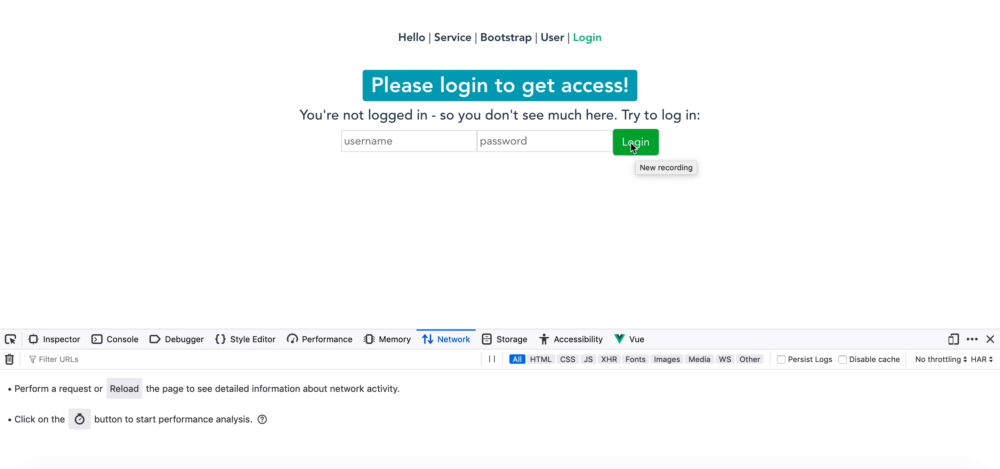


#### Protect multiple Vue.js components

Now we have a working Login component. Now let's create a new `Protected.vue` component, since we want to have something that's only accessible, if somebody has logged in correctly:

```
<template>
  <div class="protected" v-if="loginSuccess">
    <h1><b-badge variant="success">Access to protected site granted!</b-badge></h1>
    <h5>If you're able to read this, you've successfully logged in.</h5>
  </div>
  <div class="unprotected" v-else>
    <h1><b-badge variant="info">Please login to get access!</b-badge></h1>
    <h5>You're not logged in - so you don't see much here. Try to log in:</h5>
    <router-link :to="{ name: 'Login' }" exact target="_blank">Login</router-link>
  </div>

</template>

<script>
import api from './backend-api'

export default {
  name: 'protected',

  data () {
    return {
      loginSuccess: false,
      error: false
    }
  },
  methods: {
    //
  }
}

</script>
```

This component should only be visible, if the appropriate access was granted at the Login. Therefore we need to solve 2 problems:

* __Store the login state__
* __Redirect user from Protected.vue to Login.vue, if not authenticated before__


#### Store login information with vuex

The super dooper simple solution would be to simply use `LocalStorage`. But with [vuex](https://github.com/vuejs/vuex) there is a centralized state management in Vue.js, which is pretty popular. So we should invest some time to get familiar with it. There's a full guide available: https://vuex.vuejs.org/guide/ and a great introductory blog post here: https://pusher.com/tutorials/authentication-vue-vuex

You could also initialize a new Vue.js project with Vue CLI and mark the `vuex` checkbox. But we try to extend the current project here.

First we add [the vuex dependency](https://www.npmjs.com/package/vuex) into our [package.json](frontend/package.json):

```
...
    "vue": "^2.6.10",
    "vue-router": "^3.0.6",
    "vuex": "^3.1.1"
  },
```

> There are four things that go into a Vuex module: the initial [state](https://vuex.vuejs.org/guide/state.html), [getters](https://vuex.vuejs.org/guide/getters.html), [mutations](https://vuex.vuejs.org/guide/mutations.html) and [actions](https://vuex.vuejs.org/guide/actions.html)

#### Define the vuex state

To implement them, we create a new [store.js](frontend/src/store.js) file:

```
import Vue from 'vue'
import Vuex from 'vuex'

Vue.use(Vuex)

export default new Vuex.Store({
    state: {
        loginSuccess: false,
        loginError: false,
        userName: null
    },
  mutations: {

  },
  actions: {

  },
  getters: {
  
  }
})

``` 

We only have an initial state here, which is that a login could be successful or not - and there should be a `userName`.


#### Define a vuex action login() and the mutations login_success & login_error

Then we have a look onto __vuex actions: They provide a way to commit mutations to the vuex store.__ 

As our app here is super simple, we only have one action to implement here: `login`. We omit the `logout` and `register` actions, because we only define one admin user in the Spring Boot backend right now and don't need an implemented logout right now. Both could be implemented later!

We just shift our logic on how to login a user from the `Login.vue` to our vuex action method:

```
    mutations: {
        login_success(state, name){
            state.loginSuccess = true
            state.userName = name

        },
        login_error(state){
            state.loginError = true
            state.userName = name
        }
    },
    actions: {
        async login({commit}, user, password) {
            api.getSecured(user, password)
                .then(response => {
                    console.log("Response: '" + response.data + "' with Statuscode " + response.status);
                    if(response.status == 200) {
                        // place the loginSuccess state into our vuex store
                        return commit('login_success', name);
                    }
                }).catch(error => {
                    console.log("Error: " + error);
                    // place the loginError state into our vuex store
                    commit('login_error', name);
                    return Promise.reject("Invald credentials!")
                })
        }
    },
```

Instead of directly setting a boolean to a variable, we `commit` a mutation to our store if the authentication request was successful or unsuccessful. We therefore implement two simple mutations: `login_success` & `login_error`


#### Last but not least: define getters for the vuex state

To be able to access vuex state from within other components, we need to implement getters inside our vuex store. As we only want some simple info, we need the following getters:

```
    getters: {
        isLoggedIn: state => state.loginSuccess,
        hasLoginErrored: state => state.loginError
    }
```

#### Use vuex Store inside the Login component and forward to Protected.vue, if Login succeeded

Instead of directly calling the auth endpoint via axios inside our Login component, we now want to use our vuex store and its actions instead. Therefore we don't even need to import the [store.js](frontend/src/store.js) inside our `Login.vue`, we can simply access it through `$store`. Thy is that? Because we already did that inside our [main.js](frontend/src/main.js):

```
import store from './store'

...

new Vue({
    router,
    store,
    render: h => h(App)
}).$mount('#app')
```

With that configuration `store` and `router` are accessible from within every Vue component with the `$` prefixed :) 

If we have a look into our `Login.vue` we see that in action:

```
callLogin() {
      this.$store.dispatch('login', { user: this.user, password: this.password})
        .then(() => this.$router.push('/Protected'))
        .catch(error => {
          this.error.push(error)
        })
    }
```

Here we access our vuex store action `login` and issue a login request to our Spring Boot backend. If this succeeds, we use the Vue `$router` to forward the user to our `Protected.vue` component.


#### Redirect user from Protected.vue to Login.vue, if not authenticated before

Now let's enhance our [router.js](frontend/src/router.js) slightly. We use the Vue.js routers' [meta field](https://router.vuejs.org/guide/advanced/meta.html) feature to check, whether a user is loggin in already and therefore should be able to access our Protected component with the URI `/protected` :

```
    {
        path: '/protected',
        component: Protected,
        meta: { 
            requiresAuth: true 
        }
    },
``` 

We also add a new behavior to our router, that checks if it requires authentication every time a route is accessed. If so, it will redirect to our Login component:

```
router.beforeEach((to, from, next) => {
    if (to.matched.some(record => record.meta.requiresAuth)) {
        // this route requires auth, check if logged in
        // if not, redirect to login page.
        if (!store.getters.isLoggedIn) {
            next({
                path: '/login'
            })
        } else {
            next();
        }
    } else {
        next(); // make sure to always call next()!
    }
});
```

Now if one clicks onto `Protected` and didn't login prior, our application redirects to `Login` automatically:


With this redirect, we also don't need the part with `<div class="protected" v-if="loginSuccess">` inside our Login.vue, since in case of a successful login, the user is directly redirected to the Protected.vue.


## Check auth state at secured backend endpoints

We're now already where we wanted to be at the first place: Our Spring Boot backend has a secured API endpoint, which works with simple user/password authentication. And our Vue.js frontend uses this endpoint to do a Login and protect the `Protected` component, if the user didn't log in before. The login state is held in the frontend, using the `vuex` store.

Now if we want to go a step ahead and call a secured API endpoint in the backend from within our `Protected` frontend component, we need to fully store the credentials inside our `vuex` store, so we could access our secured resource


        +-----------------------------------------------------------------------+
        |  Vue.js frontend                                                      |
        |                          +----------------------------------------+   |
        |                          |                vuex store              |   |
        |                          +----------------------------------------+   |
        |                                   |                      |            |
        |   +-----------------+    +-----------------+    +-----------------+   |
        |   |                 |    |                 |    |                 |   |
        |   |                 |    |    Login.vue    |    |    Protected    |   |
        |   |                 |    |                 |    |                 |   |
        |   +-----------------+    +-----------------+    +-----------------+   |
        |                                           |               |           |
        +-------------------------------------------|---------------|-----------+
                                                    |-------------| |  
                   +---+                  +---+                  +---+
                   |   | /api/hello       |   | /api/user        |   | /api/secured
                   +---+                  +---+                  +---+
                     |                      |                      |
        +-----------------------------------------------------------------------+
        |                                                                       |
        |                                                                       |
        |                                                                       |
        |                                                                       |
        |                                                                       |
        |                                                                       |
        |  Spring Boot backend                                                  |
        +-----------------------------------------------------------------------+

Therefore we enhance our [store.js](frontend/src/store.js):

```
export default new Vuex.Store({
    state: {
        loginSuccess: false,
        loginError: false,
        userName: null,
        userPass: null,
        response: []
    },
    mutations: {
        login_success(state, payload){
            state.loginSuccess = true;
            state.userName = payload.userName;
            state.userPass = payload.userPass;
        },
    ...
    },
    actions: {
        login({commit}, {user, password}) {
            ...
                            // place the loginSuccess state into our vuex store
                            commit('login_success', {
                                userName: user,
                                userPass: password
                            });
            ...
    getters: {
        isLoggedIn: state => state.loginSuccess,
        hasLoginErrored: state => state.loginError,
        getUserName: state => state.userName,
        getUserPass: state => state.userPass
    }
```

> Be sure to use the current way to define and [interact with vuex mutations](https://vuex.vuejs.org/guide/mutations.html). Lot's of blog posts are using an old way of committing multiple parameters like `commit('auth_success', token, user)`. This DOES NOT work anymore. Only the first parameter will be set, the others are lost! 

Now inside our [Protected.vue](frontend/src/components/Protected.vue), we can use the stored credentials to access our `/secured` endpoint:

```
<script>
  import api from './backend-api'
  import store from './../store'

export default {
  name: 'protected',

  data () {
    return {
      backendResponse: '',
      securedApiCallSuccess: false,
      errors: null
    }
  },
  methods: {
    getSecuredTextFromBackend() {
      api.getSecured(store.getters.getUserName, store.getters.getUserPass)
              .then(response => {
                console.log("Response: '" + response.data + "' with Statuscode " + response.status);
                this.securedApiCallSuccess = true;
                this.backendResponse = response.data;
              })
              .catch(error => {
                console.log("Error: " + error);
                this.errors = error;
              })
    }
  }
}
```

Feel free to create a nice GUI based on `securedApiCallSuccess`, `backendResponse` and `errors` :)


# Links

Nice introductory video: https://www.youtube.com/watch?v=z6hQqgvGI4Y

Examples: https://vuejs.org/v2/examples/

Easy to use web-based Editor: https://vuejs.org/v2/examples/

http://vuetips.com/
