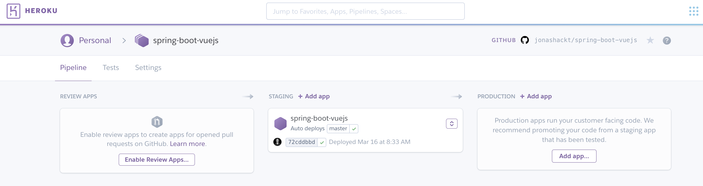
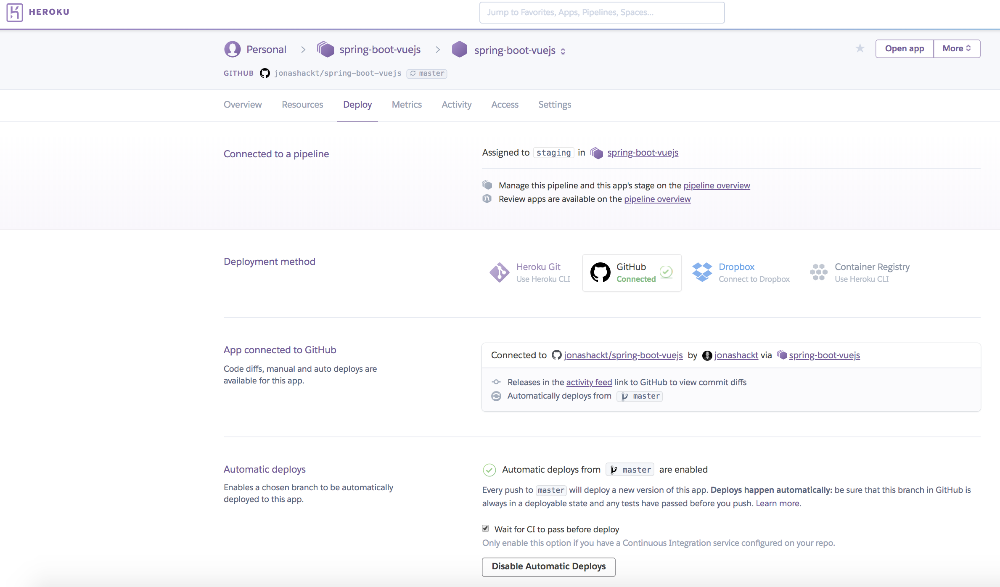

# spring-boot-vuejs

[](https://travis-ci.org/jonashackt/spring-boot-vuejs)
[](https://coveralls.io/github/jonashackt/spring-boot-vuejs?branch=master)
[](https://github.com/jonashackt/spring-boot-vuejs/blob/master/LICENSE)


A live deployment is available on Heroku: https://spring-boot-vuejs.herokuapp.com

## In Search of a new Webfrontend-Framework after 2 Years of absence...

Well I’am not a Frontend developer. I’am more like playing around with Spring Boot, Web- & Microservices & Docker, automating things with Ansible and Docker, Scaling things with Spring Cloud, Docker Compose and Traefik... And the only GUIs I’am building are the "new JS framework in town"-app every two years... :) So the last one was Angular 1 - and it felt, as it was a good choice! I loved the coding experience and after a day of training, I felt able to write awesome Frontends...

But now we’re 2 years later and I heard from afar, that there was a complete rewrite of Angular (2), a new kid in town from Facebook (React) and lots of ES201x stuff and dependency managers like bower and Co. So I’am now in the new 2-year-cycle of trying to cope up again - and so glad I found this article: https://medium.com/reverdev/why-we-moved-from-angular-2-to-vue-js-and-why-we-didnt-choose-react-ef807d9f4163

Key points are:
* Angular 2 isn’t the way to go, if you know version 1 (complete re-write, only with Typescript, loss of many of 1’s advantages, Angular 4 is coming)
* React  (facebookish problems (licence), need to choose btw. Redux & MObX, harder learning curve, slower coding speed)


And the [introduction phrase](https://vuejs.org/v2/guide/index.html) sounds really great:

> Vue (pronounced /vjuː/, like view) is a progressive framework for building user interfaces. Unlike other monolithic frameworks, Vue is designed from the ground up to be incrementally adoptable. The core library is focused on the view layer only, and is very easy to pick up and integrate with other libraries or existing projects. On the other hand, Vue is also perfectly capable of powering sophisticated Single-Page Applications when used in combination with modern tooling and supporting libraries.

So I think, it could be a good idea to invest a day or so into Vue.js. Let’s have a look here!


## Setup Vue.js & Spring Boot

### Prerequisites

#### MacOSX

```
brew install node
npm install --global vue-cli
```

#### Linux

```
sudo apt update
sudo apt install node
npm install --global vue-cli
```

#### Windows

```
choco install npm
npm install --global vue-cli
```

(Oder per Installer von der Website: https://nodejs.org/en/download/)

## Project setup

```
spring-boot-vuejs
├─┬ backend     → backend module with Spring Boot stuff
│ ├── src
│ └── pom.xml
├─┬ frontend    → frontend module with Vue.js stuff
│ └── pom.xml
└── pom.xml     → Maven parent pom with modules
```

## Backend

Go to https://start.spring.io/ and initialize an Spring Boot app with `Web` and `Actuator`. Place the zip’s contents in the backend folder.

Customize pom to copy content from Frontend for serving it later with the embedded Tomcat:

```
<build>
  <plugins>
    <plugin>
      <groupId>org.springframework.boot</groupId>
      <artifactId>spring-boot-maven-plugin</artifactId>
    </plugin>
    <plugin>
      <artifactId>maven-resources-plugin</artifactId>
      <executions>
        <execution>
          <id>copy Vue.js frontend content</id>
          <phase>generate-resources</phase>
          <goals>
            <goal>copy-resources</goal>
          </goals>
          <configuration>
            <outputDirectory>src/main/resources/public</outputDirectory>
            <overwrite>true</overwrite>
            <resources>
              <resource>
                <directory>${project.parent.basedir}/frontend/target/dist</directory>
                <includes>
                  <include>static/</include>
                  <include>index.html</include>
                </includes>
              </resource>
            </resources>
          </configuration>
        </execution>
      </executions>
    </plugin>
  </plugins>
</build>
```


## Frontend

```
vue init webpack frontend
```

This will initialize a project skeleton for Vue.js in /frontend directory - it therefore asks some questions in the cli:


If you want to learn more about installing Vue.js, head over to the docs: https://vuejs.org/v2/guide/installation.html

### Use frontend-maven-plugin to handle NPM, Node, Bower, Grunt, Gulp, Webpack and so on :)

If you’re a backend dev like me, this Maven plugin here https://github.com/eirslett/frontend-maven-plugin is a great help for you - because, if you know Maven, that’s everything you need! Just add this plugin to the frontend’s `pom.xml`:

```
<build>
  <plugins>
    <plugin>
      <groupId>com.github.eirslett</groupId>
      <artifactId>frontend-maven-plugin</artifactId>
      <version>1.5</version>
      <executions>
        <!-- Install our node and npm version to run npm/node scripts-->
        <execution>
          <id>install node and npm</id>
          <goals>
            <goal>install-node-and-npm</goal>
          </goals>
          <configuration>
            <nodeVersion>v6.11.3</nodeVersion>
            <npmVersion>5.4.1</npmVersion>
            <nodeDownloadRoot>https://nodejs.org/dist/</nodeDownloadRoot>
            <npmDownloadRoot>http://registry.npmjs.org/npm/-/</npmDownloadRoot>
          </configuration>
        </execution>
        <!-- Set NPM Registry -->
        <execution>
          <id>npm set registry</id>
          <goals>
            <goal>npm</goal>
          </goals>
          <configuration>
            <arguments>config set registry https://registry.npmjs.org</arguments>
          </configuration>
        </execution>
        <!-- Set SSL privilege -->
        <execution>
          <id>npm set non-strict ssl</id>
          <goals>
            <goal>npm</goal>
          </goals>
          <!-- Optional configuration which provides for running any npm command -->
          <configuration>
            <arguments>config set strict-ssl false</arguments>
          </configuration>
        </execution>
        <!-- Install all project dependencies -->
        <execution>
          <id>npm install</id>
          <goals>
            <goal>npm</goal>
          </goals>
          <!-- optional: default phase is "generate-resources" -->
          <phase>generate-resources</phase>
          <!-- Optional configuration which provides for running any npm command -->
          <configuration>
            <arguments>install</arguments>
          </configuration>
        </execution>
        <!-- Build and minify static files -->
        <execution>
          <id>npm run build</id>
          <goals>
            <goal>npm</goal>
          </goals>
          <configuration>
            <arguments>run build</arguments>
          </configuration>
        </execution>
      </executions>
    </plugin>
  </plugins>
</build>
```

### tell Webpack to output the dist/ contents to target/

Commonly, node projects will create a dist/ directory for final builds which contains the minified source code of the web app - but we want it all in `/target`. Therefore go to `frontend/config/index.js` and replace the following lines:

```
index: path.resolve(__dirname, '../dist/index.html'),
assetsRoot: path.resolve(__dirname, '../dist'),
```

with

```
index: path.resolve(__dirname, '../target/dist/index.html'),
assetsRoot: path.resolve(__dirname, '../target/dist'),
```


## First App run

```
mvn clean install
```

Run our complete Spring Boot App:

```
mvn --projects backend spring-boot:run
```

Now go to http://localhost:8088/ and have a look at your first Vue.js Spring Boot App.


## fast feedback with webpack-dev-server

The webpack-dev-server, which will update and build every change through all the parts of the JavaScript build-chain, is pre-configured in Vue.js out-of-the-box! So the only thing needed to get fast feedback development-cycle is to cd into `frontend` and run:

```
npm run dev
```

That’s it! 


## Browser developer tools extension

Install vue-devtools Browser extension https://github.com/vuejs/vue-devtools and get better feedback, e.g. in Chrome:


## HTTP calls from Vue.js to (Spring Boot) REST backend

Prior to Vue 2.0, there was a build in soultion (vue-resource). But from 2.0 on, 3rd party libraries are necessary. One of them is [Axios](https://github.com/mzabriskie/axios) - also see blog post https://alligator.io/vuejs/rest-api-axios/

```
npm install axios --save
```

Calling a REST service with Axios is simple. Go into the script area of your component, e.g. Hello.vue and add:

```
import axios from 'axios'

data () {
  return {
    response: [],
    errors: []
  }
},

callRestService () {
  axios.get(`api/hello`)
    .then(response => {
      // JSON responses are automatically parsed.
      this.response = response.data
    })
    .catch(e => {
      this.errors.push(e)
    })
}
}
```

In your template area you can now request a service call via calling `callRestService()` method and access `response` data:

```
<button class=”Search__button” @click="callRestService()">CALL Spring Boot REST backend service</button>

<h3>{{ response }}</h3>
```

### The problem with SOP

Single-Origin Policy (SOP) could be a problem, if we want to develop our app. Because the webpack-dev-server runs on http://localhost:8080 and our Spring Boot REST backend on http://localhost:8088.

We need to use Cross Origin Resource Sharing Protocol (CORS) to handle that (read more background info about CORS here https://developer.mozilla.org/en-US/docs/Web/HTTP/Access_control_CORS)

#### Enabling Axios CORS support

Create a central Axios configuration file called `http-commons.js`:

```
import axios from 'axios'

export const AXIOS = axios.create({
  baseURL: `http://localhost:8088`,
  headers: {
    'Access-Control-Allow-Origin': 'http://localhost:8080'
  }
})
```

Here we allow requests to the base URL of our Spring Boot App on port 8088 to be accessable from 8080.

Now we could use this configuration inside our Components, e.g. in `Hello.vue`:
```
import {AXIOS} from './http-common'

export default {
  name: 'hello',

  data () {
    return {
      posts: [],
      errors: []
    }
  },
  methods: {
    // Fetches posts when the component is created.
    callRestService () {
      AXIOS.get(`hello`)
        .then(response => {
          // JSON responses are automatically parsed.
          this.posts = response.data
        })
        .catch(e => {
          this.errors.push(e)
        })
    }
  }
```

#### Enabling Spring Boot CORS support

Additionally, we need to configure our Spring Boot backend to answer with the appropriate CORS HTTP Headers in it’s responses (theres a good tutorial here: https://spring.io/guides/gs/rest-service-cors/). Therefore we add the annotation `@CrossOrigin` to our BackendController:

```
@CrossOrigin(origins = "http://localhost:8080")
@RequestMapping(path = "/hello")
public @ResponseBody String sayHello() {
    LOG.info("GET called on /hello resource");
    return HELLO_TEXT;
}
```

Now our Backend will responde CORS-enabled and accepts requests from 8080. But as this only enables CORS on one method, we have to repeatately add this annotation to all of our REST endpoints, which isn’t a nice style. We should use a global solution to allow access with CORS enabled to all of our REST resources. This could be done in the `SpringBootVuejsApplication.class`:

```
// Enable CORS globally
@Bean
public WebMvcConfigurer corsConfigurer() {
  return new WebMvcConfigurerAdapter() {
    @Override
    public void addCorsMappings(CorsRegistry registry) {
      registry.addMapping("/api/*").allowedOrigins("http://localhost:8080");
    }
  };
}
```

Now all calls to resources behind `api/` will return the correct CORS headers. 

#### But STOP! Webpack & Vue have something much smarter for us to help us with SOP!

Thanks to my colleague [Daniel](https://www.codecentric.de/team/dre/) who pointed me to the nice proxying feature of Webpack dev-server, we don´t need to configure all the complex CORS stuff anymore!

According to [Vue.js Webpack Template](https://vuejs-templates.github.io/webpack/) the only thing we need to [configure is a Proxy](https://vuejs-templates.github.io/webpack/proxy.html) for our webpack dev-server requests. This could be done easily in the [frontend/config/index.js](https://github.com/jonashackt/spring-boot-vuejs/blob/master/frontend/config/index.js) inside `dev.proxyTable`: 

```
dev: {
    ...
    proxyTable: {
      // proxy all webpack dev-server requests starting with /api to our Spring Boot backend (localhost:8088)
      '/api': {
        target: 'http://localhost:8088',
        changeOrigin: true
      }
    },
```

With this configuration in place, the webpack dev-server uses the [http-proxy-middleware](https://github.com/chimurai/http-proxy-middleware), which is a really handy component, to proxy all frontend-requests from http://localhost:8080 --> http://localhost:8088 - incl. Changing the Origin accordingly.

This is used in the [frontend/build/dev-server.js](https://github.com/jonashackt/spring-boot-vuejs/blob/master/frontend/build/dev-server.js) to configure the proxyMiddleware (you don´t need to change something here!):

```
// proxy api requests
Object.keys(proxyTable).forEach(function (context) {
  var options = proxyTable[context]
  if (typeof options === 'string') {
    options = { target: options }
  }
  app.use(proxyMiddleware(options.filter || context, options))
})
```


## Bootstrap & Vue.js

There’s a nice integration of Bootstrap in Vue.js: https://bootstrap-vue.js.org/

```
npm install bootstrap-vue
```

Now you can use all the pretty Bootstrap stuff with ease like:

```
<b-btn @click="callRestService()">CALL Spring Boot REST backend service</b-btn>
```

instead of

```
<button type="button" class=”btn” @click="callRestService()">CALL Spring Boot REST backend service</button>
```

The docs contain all the possible components: https://bootstrap-vue.js.org/docs/components/alert/

See some elements, when you go to http://localhost:8080/#/bootstrap/ - this should look like this:


A good discussion about various UI component frameworks: http://vuetips.com/bootstrap


## Heroku Deployment

As you may already read, the app is automatically deployed to Heroku on https://spring-boot-vuejs.herokuapp.com/.

The project makes use of the nice Heroku Pipelines feature, where we do get a full Continuous Delivery pipeline with nearly no effort:



And with the help of super cool `Automatic deploys`, we have our TravisCI build our app after every push to master - and with the checkbox set to `Wait for CI to pass before deploy` - the app gets also automatically deployed to Heroku - but only, if the TravisCI (and Coveralls...) build succeeded:



You only have to connect your Heroku app to GitHub, activate Automatic deploys and set the named checkbox. That´s everything!


#### Making Port in Vue.js frontend configurable

Frontend needs to know the Port of our Spring Boot backend API, which is [automatically set by Heroku every time, we (re-)start our App](https://stackoverflow.com/a/12023039/4964553).

> You can [try out your Heroku app locally](https://devcenter.heroku.com/articles/heroku-local)! Just create a .env-File with all your Environment variables and run `heroku local`! 

To access the Heroku set port, we need to configure the used port inside our Vue.js application dynamically instead of hard-coded. This can be easily achieved with the help of enviroment variables, which can be added to the [dev.env.js](https://github.com/jonashackt/spring-boot-vuejs/blob/master/frontend/config/dev.env.js), [test.env.js](https://github.com/jonashackt/spring-boot-vuejs/blob/master/frontend/config/test.env.js) and [prod.env.js](https://github.com/jonashackt/spring-boot-vuejs/blob/master/frontend/config/prod.env.js) files. Let´s do this with the variable `API_PORT`:

```
module.exports = {
  NODE_ENV: '"production"',
  API_PORT: '"8077"'
}
```

Now we can access this variable inside our Vue.js application. Just access the variable inside the `<script>` area inside a method:

```
  logPortEnvVariable () {
    console.log('Now what´s the port?')
    console.log(process.env.API_PORT)
  }
```

If you want, have a look at [Service.vue](https://github.com/jonashackt/spring-boot-vuejs/blob/master/frontend/src/components/Service.vue), where this is implemented.

#### Using dynamic port in Vue.js frontend

Now as we need to dynamically configure the Port Heroku will set, we need to access this in the webpack build, which is our only chance to get to know the concrete port Heroku is using for our application. As we use the [frontend-maven-plugin](https://github.com/eirslett/frontend-maven-plugin), we need to somehow pass the Heroku Port through this plugin to webpack, since we don´t run webpack or npm commands manually ourselfs somewhere.

The possibilty to [configure Environment variables in the frontend-maven-plugin](https://github.com/eirslett/frontend-maven-plugin/wiki#environment-variables) does the trick: In the `Build and minify static files` section, where `npm run build` is executed, we add the following configuration to the plugin:

```
  <environmentVariables>
    <SERVER_PORT>${server.port}</SERVER_PORT>
  </environmentVariables>
```

The variable `server.port` inherits the magic then.

Because we locally don´t want to have extra hassles with setting and unsetting Environment variables for ports and want simply use port `8088` for accessing our backend, we need to be able to set a default value. This is done through the following property:

```
	<properties>
    ...
    <!-- default port, that will be replaced in the static Vue.js files for accessing the Spring Boot backend -->
    <server.port>8088</server.port>
	</properties>
```

Now, if the environment variable `PORT=7000` is defined for example (you can try this locally e.g. on a Mac with `export PORT=7000`), the variable `server.port` should instead change to 7000. Because we sadly don´t have the Spring Boot like `${VARIABLE:-default}` notation in Maven, we need to use the [<activation> feature of Maven profiles](https://stackoverflow.com/a/40756182/4964553). With this, we are able to check, if a Environment variable is set:

```
<profiles>
    <profile>
      <id>HerokuPort</id>
      <activation>
        <property>
          <name>env.PORT</name>
        </property>
      </activation>
      <properties>
        <!-- Override the default SERVER_PORT, e.g. if PORT environment variable is set
        - which is mostly the case on Heroku etc. -->
        <server.port>${env.PORT}</server.port>
      </properties>
    </profile>
  </profiles>
```

And as we can access environment variables in Maven through `${env.VARIABLE_NAME}` (see https://stackoverflow.com/a/10463133/4964553), we just use `${env.PORT}` in case the Maven profile activation feature found the `PORT` environment variable.

Now we´re able to use our newly set Environment Variable SERVER_PORT inside our `test.env.js` and `prod.env.js`:

```
API_PORT: JSON.stringify(process.env.SERVER_PORT)
```

Now our App is finally able to use the dynamically set port! You may have a look onto the Developer Console when accessing the [Service.vue](https://github.com/jonashackt/spring-boot-vuejs/blob/master/frontend/src/components/Service.vue) and see the output of the port:

> To retain the ability of using the webpack dev-server locally, we configure `API_PORT: '"8080"'` in `dev.env.js`, so that we have the right PORT setting for the webpack dev-server Proxy configuration


### Using dynamic Heroku port in Vue.js frontend

Slug -> no Port, [because no Config Variables present at that time!](https://devcenter.heroku.com/articles/how-heroku-works)

--> only Releases have config Vars, executed in Dynos!

Need to somehow execute Maven build in Dyno - because we have the Port there.

Therefore we need to fork Heroku Java buildpack, see https://github.com/heroku/heroku-buildpack-java#development and enhance the `bin/compile` file as described. See https://github.com/jonashackt/heroku-buildpack-java/commit/e8b0246c09968d8ec4c04983a9def431261a1b6c for example.

Then we need to change buildpack of our app to the forked one:

```
heroku buildpacks:set https://github.com/jonashackt/heroku-buildpack-java -a spring-boot-vuejs
```

Create `startHeroku.sh` containing a Maven build and the original startup command from the `Procfile`:

```
mvn clean install -DskipTests=true
java -Dserver.port=$PORT -jar backend/target/backend-0.0.1-SNAPSHOT.jar
```

Now change the `Procfile` to this:

```
web: sh ./startHeroku.sh
```


# Links

Nice introdutory video: https://www.youtube.com/watch?v=z6hQqgvGI4Y

Examples: https://vuejs.org/v2/examples/

Easy to use web-based Editor: https://vuejs.org/v2/examples/

http://vuetips.com/
